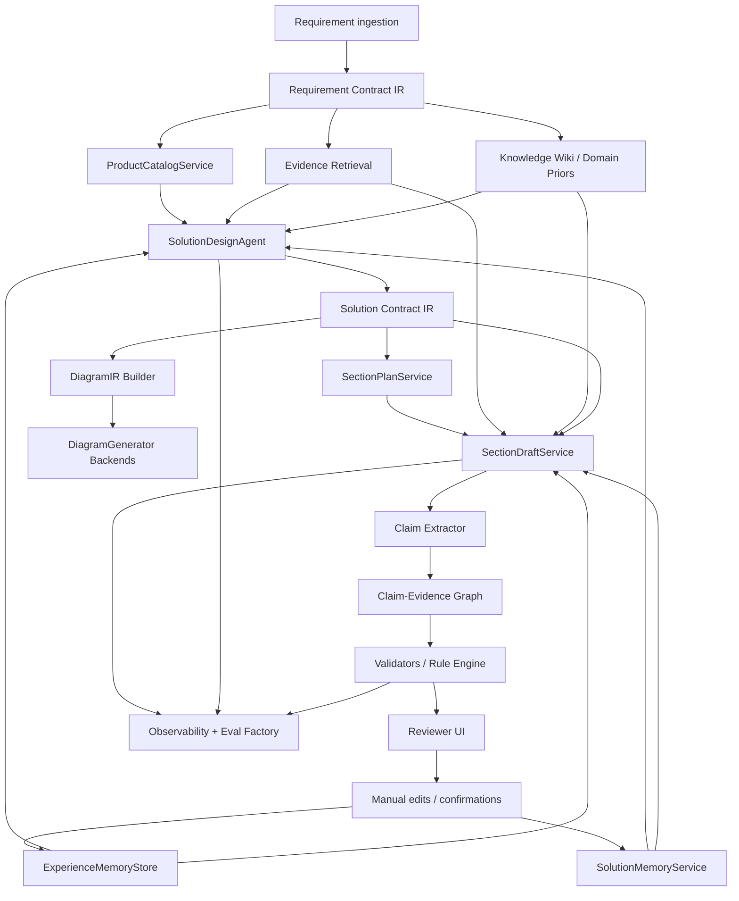
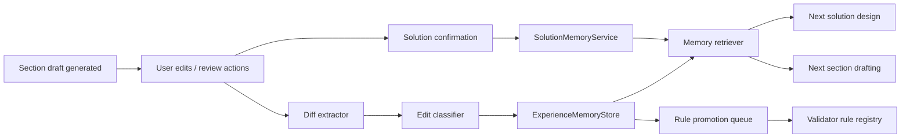

# Deep Technical Assessment and Refactor Plan for withoutdelay/RAG_test

## Executive summary

The repository has evolved from a phase-oriented MVP scaffold into a much richer, but also more entangled, pre-sales solution platform. The `main` branch still reflects the original system design in `spec.md`: project/document CRUD, parsing, retrieval, gateway masking, generation, and review. The `codex/next-iteration-optimization-20260419` branch adds a serious second layer: library/material governance, hybrid retrieval with reranking, AI Wiki-style compiled knowledge injection, and replay/evaluation telemetry. The branch visible through the connector as `codex/product-driven-solution-20260419` pushes further by introducing structured product catalog and solution snapshot flows, and by injecting solution context directly into section generation. fileciteturn43file0L1-L1 fileciteturn42file0L1-L1 fileciteturn34file0L1-L1 fileciteturn26file0L1-L1 fileciteturn32file0L1-L1 fileciteturn44file0L1-L1

The strongest conclusion is that the repository already contains most of the ingredients for the new direction you described, but not yet the right separations of concern. Today, the system has **catalog-aware selection**, **outline/evidence/section draft orchestration**, **quality gates**, **retrieval telemetry**, and **versioned solution snapshots**. What it lacks is a stable, explicit intermediate representation and the three missing “glue layers” that will make it production-grade for long-document, domain-heavy generation: **Solution Contract IR**, **memory/feedback loops**, and **claim-level validation/evidence tracking**. Without these, the product-driven branch will continue to accumulate logic inside a single giant orchestration surface instead of becoming a composable platform. fileciteturn33file0L1-L1 fileciteturn39file0L1-L1 fileciteturn44file0L1-L1

My recommendation is to treat `codex/product-driven-solution-20260419` as the **functional base** for the long-term product, and treat `codex/next-iteration-optimization-20260419` as the **stability/MVP release line**. The next deep refactor should not be “merge branches and keep coding.” It should be a layered re-architecture that freezes the MVP surface, then introduces a versioned domain contract, memory, validation, diagram IR, and observability behind compatibility adapters. This lets you preserve the current demo branch while turning the product-driven branch into the real production architecture. fileciteturn29file0L1-L1 fileciteturn30file0L1-L1 fileciteturn31file0L1-L1 fileciteturn32file0L1-L1

In practical terms, the highest-priority work is:

| Priority | What to do | Why |
|---|---|---|
| P0 | Extract a **Solution Contract IR** and make all generation consume it | This is the missing architectural spine |
| P1 | Add **SolutionMemory** and **manual-edit feedback capture** | This satisfies the “越用越聪明” requirement |
| P1 | Split the monolithic `SectionDraftService` into domain services | This is the main technical-debt choke point |
| P1 | Introduce a **rule engine + claim/evidence graph** | Needed for vertical-domain correctness and auditability |
| P2 | Add **diagram_ir** and reviewable diagram generation | Current system retrieves assets but does not generate diagrams |
| P2 | Turn replay/evals into a real **eval factory** and attach tracing | Current telemetry is promising but fragmented |

## Repository scan and current architecture

### Branch scan and entry points

The repository began as a phased scaffold. The original spec defines a classic architecture centered on `generation_tasks`, `review_points`, document parsing, vector search, a masking gateway, and agent-style generation. The `main` README still presents the project in that phased framing. fileciteturn43file0L1-L1 fileciteturn42file0L1-L1

The newer branches expose a different reality. The next-iteration router adds `library`, `retrieval`, `generation`, and `review` domain routers, while the product-driven router adds `catalog` on top of that. That means the architectural center of gravity has already shifted from “single generation task” to “library + evidence + composition + domain knowledge.” fileciteturn34file0L1-L1 fileciteturn26file0L1-L1

| Branch | Architectural stance | Key entry points |
|---|---|---|
| `main` | Phase-based MVP scaffold | `spec.md`, `README.md`, `backend/app/api/router.py`, `backend/app/api/{projects,documents,retrieval,generation,review,artifacts}.py`, gateway service |
| `codex/next-iteration-optimization-20260419` | MVP hardening + retrieval quality + knowledge governance | `backend/app/api/library.py`, `backend/app/services/retrieval/{hybrid,reranker}.py`, `backend/app/services/knowledge/{wiki_context,wiki_prior_eval}.py`, `backend/app/services/validation/project_snapshot.py` |
| `codex/product-driven-solution-20260419` | Product-driven solution design + catalog + solution snapshots | `backend/app/api/catalog.py`, `backend/app/api/artifacts.py`, `backend/app/services/catalog/service.py`, `backend/app/services/solution/{service,context}.py`, `backend/app/models/solution_snapshot.py`, `backend/app/services/composition/section_service.py` |

### Architecture mapping to the components you want

The table below maps the repository to the target architecture discussed in the prior conversation.

| Target component | Current implementation | Branch status | Assessment |
|---|---|---|---|
| RAG pipeline | Original parsing/retrieval/generation defined in `spec.md`; next branch adds library material routing and hybrid retrieval; product branch consumes evidence + case library + reusable blocks | Present across all branches, strongest in next/product | Good foundation, but split between legacy task model and newer outline/evidence/draft model fileciteturn43file0L1-L1 fileciteturn35file0L1-L1 fileciteturn36file0L1-L1 fileciteturn44file0L1-L1 |
| ProductCatalogService | `backend/app/services/catalog/service.py` + `api/catalog.py` | Present only in product-driven | Real step toward structured product knowledge, but still too file/markdown-driven and not yet the system’s canonical domain backbone fileciteturn25file0L1-L1 fileciteturn28file0L1-L1 |
| SolutionDesignAgent | Closest implementation is `app/services/solution/service.py` + solution endpoints in artifacts API | Partial in product-driven | Functionally present, but not yet expressed as a stable agent/IR boundary; currently a service, not a first-class contract-driven stage fileciteturn31file0L1-L1 fileciteturn32file0L1-L1 |
| SectionDraftService | `app/services/composition/section_service.py` | Strong in product-driven | This is the current orchestration core, but it is too large and owns too many responsibilities fileciteturn44file0L1-L1 |
| DiagramGenerator | No explicit generator; current code retrieves historical figures/tables and injects `[[ASSET:*]]` placeholders | Absent | This is the cleanest missing component; diagram retrieval exists, generation does not fileciteturn44file0L1-L1 |
| SolutionMemoryService | No dedicated service; `solution_snapshots` gives versioned solution outputs | Partial precursor in product-driven | Snapshot/versioning exists, reusable memory service does not fileciteturn33file0L1-L1 fileciteturn32file0L1-L1 |
| ExperienceMemoryStore | No dedicated store; manual edit path marks quality state stale but does not learn for future generations | Absent | This is the biggest gap relative to the customer’s “learn from edits” requirement fileciteturn44file0L1-L1 |
| Validators / rule engine | Quality gate exists; project replay validation and retrieval telemetry exist | Partial | Good base, but validators are still process-local and not claim- or rule-centric fileciteturn39file0L1-L1 fileciteturn44file0L1-L1 |
| Eval factory | Replay/eval helpers and wiki prior eval exist | Partial | Useful raw material, but not yet a unified evaluation framework or CI gate fileciteturn39file0L1-L1 fileciteturn41file0L1-L1 |
| Observability | `Job.trace_id`, generation details, retrieval traces, replay snapshots | Partial | Better than typical MVPs, but still JSON-heavy and not trace-native fileciteturn35file0L1-L1 fileciteturn39file0L1-L1 fileciteturn44file0L1-L1 |

### What each branch is really doing

`main` is still fundamentally the branch that matches the original spec: a strong parsing/retrieval/generation skeleton, but not yet shaped for domain-contract-driven, product-aware solution generation. fileciteturn43file0L1-L1 fileciteturn42file0L1-L1

`codex/next-iteration-optimization-20260419` is the branch that turns “simple RAG” into “retrieval engineering.” It adds library material governance, explicit material routes and rebuild jobs, hybrid dense+sparse scoring, a reranker abstraction, AI Wiki-style section context assembly, and replay-oriented telemetry. It materially improves retrieval quality and operational control. fileciteturn35file0L1-L1 fileciteturn36file0L1-L1 fileciteturn37file0L1-L1 fileciteturn40file0L1-L1 fileciteturn39file0L1-L1

`codex/product-driven-solution-20260419` is the branch where the system starts to look like the platform you actually want: catalog-aware product selection, versioned solution snapshots, solution confirmation, solution-context injection into section writing, and a composition service that tries to coordinate evidence, reusable historical content, catalog materials, and customer-specific solution context. This is the correct strategic direction. fileciteturn31file0L1-L1 fileciteturn32file0L1-L1 fileciteturn33file0L1-L1 fileciteturn27file0L1-L1 fileciteturn44file0L1-L1

## Gaps, technical debt, and cross-branch mismatches

### The deepest architectural mismatch

The original spec and the real codebase no longer describe the same system. The spec is built around `generation_tasks` and `review_points`; the newer branches operate around `ProposalOutline`, `RequirementCard`, `EvidenceBundle`, `SectionDraft`, `Job`, and now `SolutionSnapshot`. That is not a cosmetic naming drift. It is a genuine domain-model fork. If you continue adding features without an explicit compatibility layer, you will get an API surface that looks stable but a backend that is internally split between two conceptual eras. fileciteturn43file0L1-L1 fileciteturn33file0L1-L1 fileciteturn44file0L1-L1

### The main technical-debt hotspot

`SectionDraftService` is the largest risk area in the repository. It is not merely an application service. It currently contains retrieval scoring helpers, scenario guards, catalog-material integration logic, heading and taxonomy heuristics, asset placeholder handling, snapshot-derived section rendering, reuse selection, inter-section context handling, fallback logic, quality-gate wiring, and orchestration loops. That gives you fast iteration velocity in one branch, but it makes the next stage of productization fragile. The moment you add memory, rules, diagrams, or claim-level validation into this file, you will create a permanent God-service. fileciteturn44file0L1-L1

### Where the repo is already strong

The newer branches are not immature. They already have several production-worthy patterns:

The library/material system is much stronger than a typical RAG demo. It tracks routes such as `main_indexed`, `review_pending`, `holdout_eval`, and `conversion_required`, exposes rebuild jobs, and stores material audit state. That is a real governance layer, not a toy uploader. fileciteturn35file0L1-L1

The retrieval stack is also significantly more deliberate than standard “vector search only” RAG. The next branch explicitly implements tokenization for Chinese/English mixed text, sparse BM25-style scoring, score normalization, hybrid blending, and an optional cross-encoder reranker with a heuristic fallback. fileciteturn36file0L1-L1 fileciteturn37file0L1-L1

The evaluation and replay layer is unusually promising. `project_snapshot.py` captures section-level path, retrieval trace counts, average retrieval scores, quality status, fallback sections, and regression/improvement comparisons. `wiki_prior_eval.py` evaluates whether AI Wiki priors improve section-type and equipment-type ranking quality. These are exactly the kinds of observability/eval seeds that should become a formal eval factory. fileciteturn39file0L1-L1 fileciteturn41file0L1-L1

### What is missing for the long-term product

The three largest gaps are structural.

First, there is still no **stable intermediate representation** between requirement understanding, solution design, section planning, and final document generation. The product branch has the right data concepts, but they are still expressed as service-local dicts, JSON blobs, or implicit conventions rather than a versioned, explicit domain contract. fileciteturn32file0L1-L1 fileciteturn33file0L1-L1 fileciteturn44file0L1-L1

Second, there is no dedicated **memory loop**. The repository can store solution snapshots and draft states, but it does not yet convert user confirmations, manual edits, review resolutions, or final accepted wording into reusable memory that changes future generations. That is the direct gap versus the customer requirement that the system should become smarter with use. fileciteturn33file0L1-L1 fileciteturn44file0L1-L1

Third, diagram handling is retrieval-only. The system can find tables, figures, and formula candidates and place placeholders, but there is no `DiagramGenerator`, no `diagram_ir`, no backend abstraction for Mermaid/Graphviz/PlantUML/KiCad-like outputs, and no diagram review lifecycle. fileciteturn44file0L1-L1

### Branch reconciliation workstreams

Rather than thinking in raw branch merges, think in reconciliation workstreams.

| Workstream | From | Into | What must be reconciled |
|---|---|---|---|
| Legacy model reconciliation | `main` | product-driven | Bridge old `generation_tasks` era to outline/evidence/draft/snapshot era |
| Retrieval/eval preservation | next-iteration | product-driven | Keep hybrid retrieval, AI Wiki, replay snapshots, reranking, material governance |
| Product domain formalization | product-driven | future refactor branch | Convert catalog + solution services into versioned IR-driven domain services |
| Operational hardening | next/product | future refactor branch | Replace JSON-heavy traces and job blobs with structured observability, eval gates, and memory pipelines |

My high-confidence read is that the product-driven branch already depends on large parts of the next-iteration branch conceptually, so the critical work is no longer “merge features.” It is “extract coherent stable layers from the already-combined branch.” fileciteturn34file0L1-L1 fileciteturn40file0L1-L1 fileciteturn44file0L1-L1

## Target architecture and phased refactor plan

### Recommended target architecture



The architectural principle is simple: **everything upstream produces typed contracts, everything downstream consumes them, and everything users correct becomes memory**.

### Phased implementation plan

#### Phase zero stabilization

Before deep refactoring, freeze the MVP surface. Preserve `codex/next-iteration-optimization-20260419` as the demo/release line. Start the real refactor from `codex/product-driven-solution-20260419`. Do not keep both as active innovation branches for long; that will multiply drift. Add architecture tests and compatibility expectations first.

| Task | Code-level work | Effort | Risk | Timeline |
|---|---|---:|---:|---:|
| Freeze MVP line | Tag current next-iteration branch; allow only bugfixes | Low | Low | 2–3 days |
| Create refactor branch | Branch from product-driven and declare it the future trunk | Low | Low | 1 day |
| Add architecture boundaries | Introduce packages: `contracts`, `memory`, `validators`, `diagrams`, `evals`, `observability` | Medium | Low | 3–4 days |

#### Phase one Solution Contract IR

This is the highest-value refactor. It turns “dicts and JSON blobs” into a durable domain spine.

**Create new package structure**

```text
backend/app/contracts/
  requirement_contract.py
  solution_contract.py
  section_plan.py
  diagram_ir.py
  claim_graph.py
```

**Core code tasks**

1. Extract a typed `RequirementContract`.
2. Extract a typed `SolutionContract` from `SolutionService`.
3. Make `SectionDraftService` accept `SolutionContract` instead of raw solution/service-local context.
4. Add schema versioning and serialization.
5. Keep old APIs alive by adapting outputs into the new contract.

**Recommended IR shape**

```python
from pydantic import BaseModel, Field
from typing import Literal
from uuid import UUID

class ProductSelection(BaseModel):
    product_family: str
    model_number: str | None = None
    role: str
    quantity: int | None = None
    reason: str | None = None
    source_refs: list[str] = Field(default_factory=list)

class InterfaceIntent(BaseModel):
    interface_name: str
    protocol: str | None = None
    direction: Literal["inbound", "outbound", "bidirectional"]
    required: bool = True
    notes: str | None = None

class SectionPlan(BaseModel):
    section_id: str
    title: str
    section_type: str
    writing_mode: Literal["snapshot_primary", "reuse_first", "llm_write", "manual_only"]
    required_claim_ids: list[str] = Field(default_factory=list)
    preferred_products: list[str] = Field(default_factory=list)
    required_diagram_ids: list[str] = Field(default_factory=list)

class SolutionContract(BaseModel):
    contract_id: UUID
    schema_version: str = "1.0"
    project_id: UUID
    requirement_fingerprint: str
    solution_summary: str
    selected_products: list[ProductSelection]
    interface_plan: list[InterfaceIntent]
    key_constraints: list[str]
    open_questions: list[str]
    sections: list[SectionPlan]
```

**DB migration approach**

```sql
CREATE TABLE solution_contracts (
    id UUID PRIMARY KEY DEFAULT gen_random_uuid(),
    project_id UUID NOT NULL REFERENCES projects(id) ON DELETE CASCADE,
    solution_snapshot_id UUID NULL REFERENCES solution_snapshots(id) ON DELETE SET NULL,
    schema_version VARCHAR(20) NOT NULL DEFAULT '1.0',
    status VARCHAR(30) NOT NULL DEFAULT 'draft',
    requirement_fingerprint VARCHAR(128) NOT NULL,
    contract_json JSONB NOT NULL DEFAULT '{}'::jsonb,
    created_at TIMESTAMPTZ NOT NULL DEFAULT now(),
    updated_at TIMESTAMPTZ NOT NULL DEFAULT now()
);

CREATE INDEX idx_solution_contracts_project_created
    ON solution_contracts(project_id, created_at DESC);

CREATE INDEX idx_solution_contracts_requirement_fingerprint
    ON solution_contracts(requirement_fingerprint);
```

#### Phase two product catalog normalization

The product-driven branch already has catalog-aware behavior, but the catalog is not yet the system’s authoritative domain model. Today, product material extraction still leaks file-system and markdown parsing concerns into runtime selection logic. Move catalog ingestion to an explicit pipeline.

**New services**

- `CatalogIngestionService`
- `CatalogRuleService`
- `CatalogQueryService`
- `CatalogCompatibilityService`

**New data model**

```sql
CREATE TABLE product_families (
    id UUID PRIMARY KEY DEFAULT gen_random_uuid(),
    family_code VARCHAR(64) UNIQUE NOT NULL,
    display_name TEXT NOT NULL,
    metadata JSONB NOT NULL DEFAULT '{}'::jsonb
);

CREATE TABLE product_models (
    id UUID PRIMARY KEY DEFAULT gen_random_uuid(),
    family_id UUID NOT NULL REFERENCES product_families(id) ON DELETE CASCADE,
    model_number VARCHAR(128) NOT NULL,
    status VARCHAR(20) NOT NULL DEFAULT 'active',
    attributes JSONB NOT NULL DEFAULT '{}'::jsonb,
    UNIQUE(family_id, model_number)
);

CREATE TABLE catalog_materials (
    id UUID PRIMARY KEY DEFAULT gen_random_uuid(),
    family_id UUID NULL REFERENCES product_families(id) ON DELETE SET NULL,
    material_type VARCHAR(40) NOT NULL,
    source_kind VARCHAR(40) NOT NULL,
    source_uri TEXT NOT NULL,
    quality_tier VARCHAR(20) NOT NULL DEFAULT 'medium',
    content_json JSONB NOT NULL DEFAULT '{}'::jsonb,
    content_embedding_ref TEXT NULL,
    created_at TIMESTAMPTZ NOT NULL DEFAULT now()
);
```

| Task | Code-level work | Effort | Risk | Timeline |
|---|---|---:|---:|---:|
| Normalize catalog entities | Move from file-first parsing to authoritative DB rows | High | Medium | 2–3 weeks |
| Extract selection rules | Promote eligibility/filtering from helpers to rule service | Medium | Medium | 1–2 weeks |
| Version catalog outputs | Add `catalog_version` and compatibility snapshots | Medium | Low | 3–4 days |

#### Phase three SolutionMemory and ExperienceMemory

This is the answer to the customer’s “learn from use” requirement.

The right design here is **M-flow-lite**, not a heavyweight framework transplant. Use the existing outline/snapshot/job model, but introduce an explicit memory layer with two memory classes:

- **Solution memory**: confirmed design decisions, preferred product combinations, interface patterns, section patterns.
- **Experience memory**: diff-derived lessons from manual edits, rejections, reviewer corrections, terminology preferences, and rule promotions.



**New tables**

```sql
CREATE TABLE manual_edit_events (
    id UUID PRIMARY KEY DEFAULT gen_random_uuid(),
    project_id UUID NOT NULL REFERENCES projects(id) ON DELETE CASCADE,
    section_draft_id UUID NULL REFERENCES section_drafts(id) ON DELETE SET NULL,
    solution_snapshot_id UUID NULL REFERENCES solution_snapshots(id) ON DELETE SET NULL,
    event_type VARCHAR(40) NOT NULL,       -- edit, approve, reject, confirm
    before_text TEXT NULL,
    after_text TEXT NULL,
    diff_json JSONB NOT NULL DEFAULT '{}'::jsonb,
    editor_notes TEXT NULL,
    created_at TIMESTAMPTZ NOT NULL DEFAULT now()
);

CREATE TABLE experience_memory_entries (
    id UUID PRIMARY KEY DEFAULT gen_random_uuid(),
    memory_type VARCHAR(40) NOT NULL,      -- wording_pref, rule_hint, product_pattern, section_template
    scope_json JSONB NOT NULL DEFAULT '{}'::jsonb,
    canonical_text TEXT NOT NULL,
    embedding_source_text TEXT NOT NULL,
    evidence_json JSONB NOT NULL DEFAULT '{}'::jsonb,
    usage_count INT NOT NULL DEFAULT 0,
    acceptance_count INT NOT NULL DEFAULT 0,
    status VARCHAR(20) NOT NULL DEFAULT 'active',
    created_at TIMESTAMPTZ NOT NULL DEFAULT now(),
    updated_at TIMESTAMPTZ NOT NULL DEFAULT now()
);

CREATE TABLE solution_memory_entries (
    id UUID PRIMARY KEY DEFAULT gen_random_uuid(),
    project_id UUID NULL REFERENCES projects(id) ON DELETE SET NULL,
    source_solution_snapshot_id UUID NULL REFERENCES solution_snapshots(id) ON DELETE SET NULL,
    requirement_fingerprint VARCHAR(128) NOT NULL,
    memory_json JSONB NOT NULL DEFAULT '{}'::jsonb,
    created_at TIMESTAMPTZ NOT NULL DEFAULT now()
);
```

**Code-level tasks**

- Hook `update_section`, reviewer approval/rejection, and solution confirmation into edit-event capture.
- Add a diff-to-memory classifier:
  - wording preference
  - numeric correction
  - catalog compatibility correction
  - structural reorganization
  - banned phrase / preferred term
- Embed memory entries and retrieve them by:
  - requirement fingerprint
  - section type
  - product family
  - interface profile
- Inject memory into `SolutionService` and `SectionDraftService` through dedicated facades, not helper calls inside the orchestration file.

| Task | Code-level work | Effort | Risk | Timeline |
|---|---|---:|---:|---:|
| Edit event capture | Wire all human-touch endpoints to event recording | Medium | Low | 1 week |
| Memory compaction pipeline | Diff classifier + canonicalization + dedupe | High | Medium | 2 weeks |
| Memory retrieval | Vector + metadata filtering; inject into design/drafting | High | Medium | 1–2 weeks |

#### Phase four validators, rules, and claim-evidence graph

The repository already has quality gates and replay telemetry. The next step is to validate **claims**, not just documents.

**New components**

- `ClaimExtractor`
- `ClaimEvidenceLinker`
- `RuleRegistry`
- `ValidationRunService`

**New tables**

```sql
CREATE TABLE claim_nodes (
    id UUID PRIMARY KEY DEFAULT gen_random_uuid(),
    section_draft_id UUID NOT NULL REFERENCES section_drafts(id) ON DELETE CASCADE,
    claim_type VARCHAR(40) NOT NULL,        -- numeric, product, interface, schedule, requirement
    claim_text TEXT NOT NULL,
    normalized_key VARCHAR(255) NULL,
    structured_value JSONB NOT NULL DEFAULT '{}'::jsonb,
    created_at TIMESTAMPTZ NOT NULL DEFAULT now()
);

CREATE TABLE claim_evidence_edges (
    id UUID PRIMARY KEY DEFAULT gen_random_uuid(),
    claim_id UUID NOT NULL REFERENCES claim_nodes(id) ON DELETE CASCADE,
    evidence_ref_type VARCHAR(40) NOT NULL, -- evidence_bundle, reusable_block, catalog_material, solution_memory
    evidence_ref_id TEXT NOT NULL,
    support_type VARCHAR(20) NOT NULL,      -- support, contradict, weak_support
    score NUMERIC(6,4) NOT NULL DEFAULT 0
);

CREATE TABLE validation_runs (
    id UUID PRIMARY KEY DEFAULT gen_random_uuid(),
    project_id UUID NOT NULL REFERENCES projects(id) ON DELETE CASCADE,
    draft_version INT NOT NULL,
    run_type VARCHAR(40) NOT NULL,          -- section, project, pre_export
    result_json JSONB NOT NULL DEFAULT '{}'::jsonb,
    created_at TIMESTAMPTZ NOT NULL DEFAULT now()
);
```

**Rule engine scope**

Start with deterministic rules first:

- required section coverage
- product compatibility with catalog
- interface consistency with selected products
- numeric consistency across sections
- banned terms / preferred terms
- unresolved open questions in “customer-ready” sections
- unsupported claims lacking evidence links

Only after deterministic rules stabilize should you add LLM-judge-style qualitative validators.

#### Phase five diagram_ir and diagram generation

This is absent today and should be introduced carefully.

**Principle:** do not generate executable engineering artifacts first. Generate **reviewable diagram intents** first.

**MVP diagram scope**

- architecture topology
- interface flow
- deployment / cabinet layout intent
- equipment relationship diagrams

**IR**

```python
class DiagramNode(BaseModel):
    id: str
    label: str
    node_type: str
    metadata: dict = Field(default_factory=dict)

class DiagramEdge(BaseModel):
    source: str
    target: str
    label: str | None = None
    edge_type: str = "link"

class DiagramIR(BaseModel):
    diagram_id: str
    diagram_kind: str
    title: str
    nodes: list[DiagramNode]
    edges: list[DiagramEdge]
    annotations: list[str] = Field(default_factory=list)
    source_refs: list[str] = Field(default_factory=list)
```

**Backends**

- MVP: Mermaid
- Next: Graphviz / PlantUML
- Future specialized electrical drawing adapter: separate plugin, not core orchestration logic

**New API**

```python
@router.post("/api/v2/diagrams:generate")
async def generate_diagrams(
    request: GenerateDiagramRequest,
) -> GenerateDiagramResponse: ...
```

#### Phase six eval factory and observability

The next branch already contains the raw material; formalize it.

**Eval factory responsibilities**

- retrieval eval
- rerank eval
- section quality eval
- memory helpfulness eval
- citation coverage / unsupported-claim rate
- regression gating in CI

**Observability responsibilities**

- per-request trace
- per-section spans
- retrieval span with candidate sets
- memory retrieval span
- validator span
- export/run summaries

**Implementation**

- Add OpenTelemetry instrumentation around:
  - `SolutionService`
  - `SectionDraftService`
  - retrieval services
  - validators
  - diagram generation
- Keep `Job.trace_id`, but make it one field in a real trace model, not the observability model itself.
- Persist compact run artifacts to dedicated tables instead of packing everything into `validator_result` and `job.output_ref`.

## Sample API signatures and compatibility strategy

### Recommended v2 API surface

Keep current endpoints for the MVP branch, but introduce a coherent v2 domain API.

```python
POST /api/v2/solutions/design
{
  "project_id": "uuid",
  "requirement_card_id": "uuid",
  "catalog_scope": {
    "product_line": "electrical",
    "family_codes": ["vfd", "transformer"]
  },
  "mode": "draft"
}
-> {
  "solution_snapshot_id": "uuid",
  "solution_contract_id": "uuid",
  "solution_contract": {...}
}
```

```python
POST /api/v2/solutions/{solution_snapshot_id}/confirm
{
  "confirmation_notes": "Use preferred DCS protocol and keep supply boundary concise."
}
-> {
  "status": "confirmed",
  "memory_entries_created": 3
}
```

```python
POST /api/v2/sections/{section_id}:draft
{
  "project_id": "uuid",
  "solution_contract_id": "uuid",
  "preferred_memory_ids": [],
  "preferred_citation_ids": []
}
-> {
  "draft_id": "uuid",
  "claims": [...],
  "citations": [...],
  "quality_gate": {...}
}
```

```python
POST /api/v2/sections/{draft_id}:feedback
{
  "action": "edit",
  "before_text": "...",
  "after_text": "...",
  "notes": "Use company-preferred wording for interlock."
}
-> {
  "memory_candidate_ids": ["uuid1", "uuid2"]
}
```

### Compatibility adapter strategy

| Current endpoint | Keep? | Future behavior |
|---|---|---|
| Existing `artifacts` generation endpoints | Yes | Adapter into `SolutionContract` + `SectionDraftService` |
| Current catalog endpoints | Yes | Keep, but back them with normalized catalog services |
| Existing update/regenerate section endpoints | Yes | Add dual-write to edit-event/memory tables |
| Library material endpoints | Yes | Keep; later migrate audit state from JSON file to database-backed governance |

## Recommended production tech choices

These are production recommendations optimized for **minimal disruption to the repo’s current direction**, not greenfield purity.

| Layer | Recommendation | Why | Tradeoff |
|---|---|---|---|
| System of record | PostgreSQL | Already central; best place for contracts, rules, edits, snapshots, claims | Needs disciplined JSONB usage |
| Vector store | Keep Qdrant | Existing repo already uses it; good fit for doc/memory retrieval with payload filters | Two-store architecture remains |
| Dense embeddings | Strong multilingual/domain model such as `bge-m3` class | Better for Chinese/English mixed technical corpora and long-form retrieval | Larger inference footprint |
| Cheap fallback embeddings | Smaller bilingual model for local/dev | Preserves existing lightweight dev ergonomics | Lower retrieval quality |
| Reranker | Cross-encoder in prod, heuristic fallback in dev | Matches current architecture and gives controlled cost/quality tradeoff | Extra latency |
| LLMs for structured stages | Use a strong structured-output model for contracts/extraction | Solution IR and validators need reliable JSON | Slightly higher cost |
| LLMs for long writing | Use higher-context writing model behind current provider abstraction | Section drafting still needs high-quality long-form generation | Cost and variance need strong evals |
| Memory store | PostgreSQL + Qdrant hybrid | Postgres for canonical memory rows; Qdrant for semantic recall | Requires sync pipeline |
| Rule engine | Start simple: Python registry + JSON-configurable rules | Easier to debug and version than full rule engines | Less dynamic at first |
| Claim graph | Relational tables first, not Neo4j | Easier ops, enough for first version | Complex graph analysis is less elegant |
| Observability | OpenTelemetry + OTLP backend | Best way to turn current `trace_id` into a real trace model | Requires instrumentation work |
| Diagram backend | Mermaid first | Fastest reviewable diagram output | Not sufficient for full electrical CAD |

### Specific production stance for this repo

The most important tooling decision is **not** to introduce too many new infrastructure primitives at once. Do **not** add Neo4j, a separate rules engine, a separate memory DB, and a diagram service all in one pass. The repo already has Postgres, Qdrant, SQLAlchemy, Alembic, job traces, and JSON-heavy service outputs. The best production tradeoff is to build the next layer with **Postgres + Qdrant + typed contracts + OTel**, and only then split specialized infrastructure out if scale proves it necessary. This keeps rollout risk low while still giving you a modern architecture.

## Migration and rollout strategy

### Non-disruptive migration path

The safest migration is **additive and dual-write**, not destructive.

1. **Do not rewrite the MVP branch.**
   Keep `codex/next-iteration-optimization-20260419` stable for demos.

2. **Build the new architecture on top of the product-driven branch.**
   That branch already contains solution snapshots, catalog services, and section orchestration.

3. **Add new tables first, without deleting old ones.**
   Introduce `solution_contracts`, edit-event tables, memory tables, and claim/validation tables.

4. **Backfill from existing data.**
   - `solution_snapshots` → `solution_contracts`
   - `section_drafts` + `citation_refs` + `validator_result` → initial claim/evidence seeds
   - confirmed solutions → initial solution memory entries

5. **Keep old API responses stable.**
   New services should initially be called from old endpoints.

6. **Introduce feature flags.**
   - `FEATURE_SOLUTION_CONTRACT_V1`
   - `FEATURE_MEMORY_RETRIEVAL`
   - `FEATURE_RULE_ENGINE_STRICT`
   - `FEATURE_DIAGRAM_IR`
   - `FEATURE_CLAIM_GRAPH`

7. **Roll out in read-before-write mode where possible.**
   For memory and validators, start by logging and observing, then enforcing.

### Recommended rollout order

| Rollout step | User-visible change | Risk control |
|---|---|---|
| Add Solution Contract IR | None initially | Adapter-only phase |
| Add dual-write snapshots → contracts | None | Compare old/new outputs |
| Add edit-event capture | None | Logging only |
| Add memory retrieval in suggestion mode | Minor generation differences | Feature flag + eval gate |
| Add validators in warning mode | Review UI gains warnings | No hard blocking yet |
| Add claim/evidence graph | Auditability improves | Used for observability first |
| Add diagram_ir MVP | New optional artifact | Review-only output first |

### CI and test plan

The repository already has tests, but the refactor needs different types of safety rails.

| Test layer | What to add |
|---|---|
| Unit | Contract schema tests, memory classification tests, rule tests, claim-link tests |
| Service | Solution design service, memory retrieval service, diagram IR builder |
| Regression | Golden project replay tests using existing replay snapshot approach |
| Migration | Alembic upgrade/downgrade smoke tests on ephemeral DB |
| API | Compatibility tests for current endpoints and new `/api/v2/*` |
| CI quality gate | Unsupported-claim rate, retrieval regression, rule regression, memory-hit precision |
| Observability | Trace completeness checks for key workflows |

A good CI pipeline for the refactor would run:

- `ruff`
- `mypy`
- `pytest -m unit`
- `pytest -m service`
- `alembic upgrade head && alembic downgrade -1`
- retrieval/regression replay evals
- contract backward-compatibility snapshot tests
- OpenAPI diff checks

## Prioritized implementation table

| Phase | Deliverable | Main files/packages to create or refactor | Effort | Risk | Suggested duration |
|---|---|---|---:|---:|---:|
| Stabilization | Freeze MVP / create refactor branch | CI, branch policy, ADRs | Low | Low | 1 week |
| Solution Contract IR | Versioned solution/domain contracts | `app/contracts/*`, adapters in `solution/service.py`, `section_service.py` | High | Medium | 2–3 weeks |
| Catalog normalization | Catalog as canonical domain source | `app/services/catalog/*`, DB migrations | High | Medium | 2–3 weeks |
| Experience memory | Edit-event capture + memory compaction | `app/services/memory/*`, event hooks in section/review APIs | High | Medium | 2–3 weeks |
| Validators + claim graph | Deterministic correctness layer | `app/services/validators/*`, `app/services/claims/*` | High | High | 2–3 weeks |
| diagram_ir | Reviewable diagram generation | `app/services/diagrams/*` | Medium | Medium | 1–2 weeks |
| Eval factory + tracing | Quality gates + OTel | `app/evals/*`, instrumentation | Medium | Low | 1–2 weeks |
| Cutover | Feature-flagged rollout and backfill | scripts, backfills, adapters | Medium | Medium | 1–2 weeks |

## Open questions and limitations

This analysis is high-confidence on the repository’s direction and architecture because it is grounded in the code and branch surfaces I inspected. The main limitations are these:

- I did not execute the repository or inspect every file; this is a static architecture/code reading.
- The connector-visible product branch name was `codex/product-driven-solution-20260419`. If there is another similarly named private branch not visible through the connector, this report does not cover it.
- I did not find meaningful PR/issue evidence in this pass, so the report is primarily code- and README-driven rather than discussion-driven.
- The external-source portion of the research is lighter than the repository analysis. The recommendations here are therefore intentionally **repo-first and production-pragmatic**, not framework-prescriptive.

Even with those limitations, the central recommendation is stable: **the product-driven branch is the right strategic base, but it now needs an architecture spine**. If you add **Solution Contract IR**, **memory**, **rule/claim validation**, and **diagram_ir** as first-class layers, the repository can move from “clever long-document generator” to a durable vertical-domain solution platform.