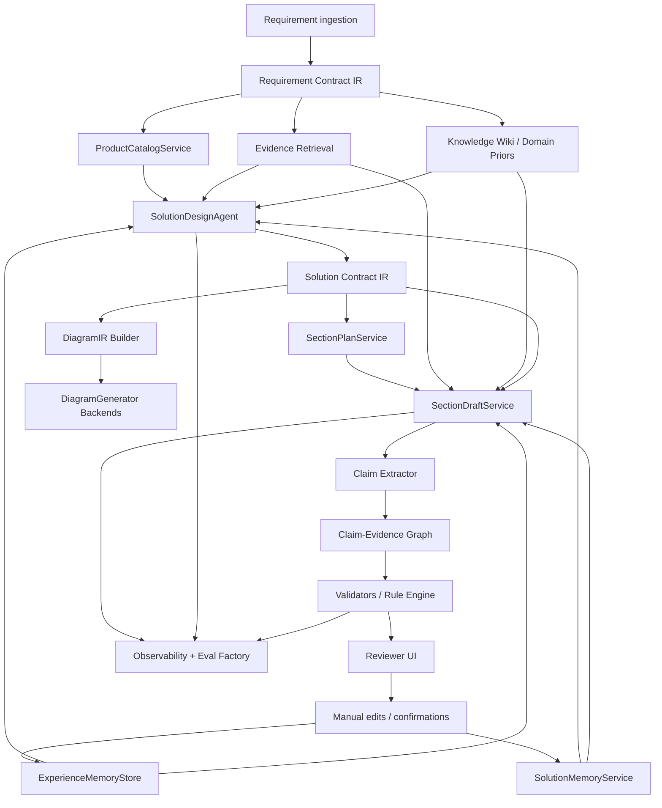
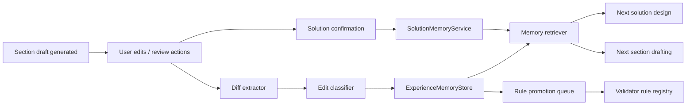

# withoutdelay/RAG_test 深度技术评估与重构计划

> 说明：本文件基于 `deep-research-report (1).md` 翻译整理。原文包含 Deep Research / GitHub 连接器生成的文件引用控制标记，在普通 Markdown 阅读器中容易显示为乱码；本中文版已清理这些标记，同时保留报告结构、技术判断、表格、代码块和实施建议。

## 执行摘要

这个仓库已经从一个按阶段推进的 MVP 脚手架，演化成一个功能更丰富、但也更耦合的售前方案平台。`main` 分支仍然反映 `spec.md` 中的原始系统设计：项目/文档 CRUD、解析、检索、网关脱敏、生成和 review。`codex/next-iteration-optimization-20260419` 分支增加了重要的第二层能力：方案库/材料治理、带 reranking 的混合检索、AI Wiki 式编译知识注入，以及 replay/evaluation telemetry。通过连接器可见的 `codex/product-driven-solution-20260419` 分支进一步推进，引入了结构化产品目录、方案快照流程，并把 solution context 直接注入章节生成。

最强结论是：这个仓库已经具备你描述的新方向所需的大部分原料，但还没有形成正确的关注点分离。当前系统已经有**目录感知的产品选择**、**大纲/证据/章节草稿编排**、**质量门禁**、**检索 telemetry** 和**版本化方案快照**。缺少的是稳定、显式的中间表示，以及让它成为生产级长文档、强领域生成系统所需的三个“胶水层”：**Solution Contract IR**、**memory/feedback loops**、**claim-level validation/evidence tracking**。如果没有这些，product-driven 分支会继续把逻辑堆进一个巨大的 orchestration surface，而不是演化成可组合平台。

我的建议是：把 `codex/product-driven-solution-20260419` 当作长期产品的**功能基座**，把 `codex/next-iteration-optimization-20260419` 当作**稳定/MVP 发布线**。下一轮深度重构不应是“合并分支然后继续写代码”。它应该是一轮分层再架构：冻结 MVP 表面，然后在兼容 adapter 后面引入版本化领域 contract、memory、validation、diagram IR 和 observability。这样可以保留当前 demo 分支，同时把 product-driven 分支转成真正的生产架构。

实际优先级如下：

| 优先级 | 要做什么 | 为什么 |
|---|---|---|
| P0 | 抽出 **Solution Contract IR**，并让所有生成逻辑消费它 | 这是缺失的架构主干 |
| P1 | 增加 **SolutionMemory** 和**人工编辑反馈捕获** | 满足“越用越聪明”的要求 |
| P1 | 拆分单体 `SectionDraftService` 为领域服务 | 这是当前主要技术债瓶颈 |
| P1 | 引入 **rule engine + claim/evidence graph** | 垂直领域正确性和审计必需 |
| P2 | 增加 **diagram_ir** 和可 review 的图纸生成 | 当前系统能召回资产，但不能生成图 |
| P2 | 把 replay/evals 升级成真正的 **eval factory**，并接入 tracing | 当前 telemetry 有潜力但较分散 |

## 仓库扫描与当前架构

### 分支扫描与入口点

仓库最初是一个分阶段脚手架。原始 spec 定义的是经典架构，中心是 `generation_tasks`、`review_points`、文档解析、向量检索、脱敏网关和 agent 风格生成。`main` 的 README 仍然以这个阶段式 framing 介绍项目。

较新的分支展现了不同现实。next-iteration router 增加了 `library`、`retrieval`、`generation` 和 `review` 领域 router；product-driven router 在此基础上增加了 `catalog`。这意味着架构重心已经从“单个生成任务”转向“library + evidence + composition + domain knowledge”。

| 分支 | 架构姿态 | 关键入口 |
|---|---|---|
| `main` | Phase-based MVP scaffold | `spec.md`, `README.md`, `backend/app/api/router.py`, `backend/app/api/{projects,documents,retrieval,generation,review,artifacts}.py`, gateway service |
| `codex/next-iteration-optimization-20260419` | MVP hardening + retrieval quality + knowledge governance | `backend/app/api/library.py`, `backend/app/services/retrieval/{hybrid,reranker}.py`, `backend/app/services/knowledge/{wiki_context,wiki_prior_eval}.py`, `backend/app/services/validation/project_snapshot.py` |
| `codex/product-driven-solution-20260419` | Product-driven solution design + catalog + solution snapshots | `backend/app/api/catalog.py`, `backend/app/api/artifacts.py`, `backend/app/services/catalog/service.py`, `backend/app/services/solution/{service,context}.py`, `backend/app/models/solution_snapshot.py`, `backend/app/services/composition/section_service.py` |

### 与目标组件的架构映射

下表把仓库当前状态映射到此前讨论过的目标架构。

| 目标组件 | 当前实现 | 分支状态 | 评估 |
|---|---|---|---|
| RAG pipeline | 原始 parsing/retrieval/generation 在 `spec.md` 中定义；next 分支增加 library material routing 和 hybrid retrieval；product 分支消费 evidence + case library + reusable blocks | 所有分支均存在，next/product 最强 | 基础很好，但 legacy task model 和较新的 outline/evidence/draft model 被分开了 |
| ProductCatalogService | `backend/app/services/catalog/service.py` + `api/catalog.py` | 仅 product-driven 存在 | 迈向结构化产品知识的真实一步，但仍然过于 file/markdown-driven，还不是系统的 canonical domain backbone |
| SolutionDesignAgent | 最接近的是 `app/services/solution/service.py` + artifacts API 中的 solution endpoints | product-driven 中部分存在 | 功能上已存在，但尚未表达为稳定 agent/IR 边界；目前是 service，不是一等 contract-driven stage |
| SectionDraftService | `app/services/composition/section_service.py` | product-driven 中很强 | 当前 orchestration core，但过大，承担了太多职责 |
| DiagramGenerator | 没有显式 generator；当前代码召回历史 figures/tables，并注入 `[[ASSET:*]]` placeholder | 缺失 | 这是最清晰的缺失组件；图纸召回存在，图纸生成不存在 |
| SolutionMemoryService | 无专用服务；`solution_snapshots` 提供版本化 solution outputs | product-driven 中有前身 | snapshot/versioning 已有，可复用 memory service 没有 |
| ExperienceMemoryStore | 无专用 store；人工编辑路径会把 quality state 标记为 stale，但不会学习未来生成 | 缺失 | 这是相对客户“从编辑中学习”要求的最大缺口 |
| Validators / rule engine | 已有 quality gate；已有 project replay validation 和 retrieval telemetry | 部分存在 | 基础很好，但 validators 仍是 process-local，不是 claim/rule-centric |
| Eval factory | 已有 replay/eval helpers 和 wiki prior eval | 部分存在 | 是有用原料，但还不是统一 evaluation framework 或 CI gate |
| Observability | `Job.trace_id`、generation details、retrieval traces、replay snapshots | 部分存在 | 比典型 MVP 好，但仍偏 JSON-heavy，不是 trace-native |

### 每个分支实际在做什么

`main` 本质上仍是符合原始 spec 的分支：有较强的 parsing/retrieval/generation 骨架，但还没有塑造成 domain-contract-driven、product-aware 的方案生成系统。

`codex/next-iteration-optimization-20260419` 是把“简单 RAG”推进成“检索工程”的分支。它增加了 library material governance、显式材料路由和 rebuild jobs、hybrid dense+sparse scoring、reranker abstraction、AI Wiki 风格章节上下文组装，以及 replay-oriented telemetry。它显著提升了检索质量和运营控制能力。

`codex/product-driven-solution-20260419` 是系统开始像真正目标平台的分支：catalog-aware product selection、versioned solution snapshots、solution confirmation、solution-context injection into section writing，以及一个试图协调 evidence、可复用历史内容、catalog materials 和客户特定 solution context 的 composition service。这是正确战略方向。

## 缺口、技术债与跨分支不一致

### 最深层的架构不匹配

原始 spec 和真实代码库已经不再描述同一个系统。spec 围绕 `generation_tasks` 和 `review_points` 构建；较新的分支围绕 `ProposalOutline`、`RequirementCard`、`EvidenceBundle`、`SectionDraft`、`Job`，以及现在的 `SolutionSnapshot` 运转。这不是表面命名漂移，而是真实的 domain-model fork。如果继续在没有显式兼容层的情况下加功能，就会得到一个 API 表面看似稳定，但后端内部被分裂成两个概念时代的系统。

### 主要技术债热点

`SectionDraftService` 是仓库中风险最大的区域。它不只是一个 application service。目前它包含 retrieval scoring helpers、scenario guards、catalog-material integration logic、heading and taxonomy heuristics、asset placeholder handling、snapshot-derived section rendering、reuse selection、inter-section context handling、fallback logic、quality-gate wiring 和 orchestration loops。

这种写法让一个分支里的迭代速度很快，但会让下一阶段产品化变脆弱。一旦把 memory、rules、diagrams 或 claim-level validation 继续加进这个文件，就会形成永久性的 God-service。

### 仓库已经强的地方

较新分支并不幼稚。它们已经有几个具备生产潜力的 pattern。

library/material 系统比典型 RAG demo 强很多。它跟踪 `main_indexed`、`review_pending`、`holdout_eval`、`conversion_required` 等 route，暴露 rebuild jobs，并存储 material audit state。这是真正的治理层，不是玩具 uploader。

检索栈也比标准“只做向量检索”的 RAG 更认真。next 分支明确实现了中英混合文本 tokenization、BM25 风格 sparse scoring、score normalization、hybrid blending，以及带 heuristic fallback 的可选 cross-encoder reranker。

evaluation 和 replay 层很有潜力。`project_snapshot.py` 捕获 section-level path、retrieval trace counts、average retrieval scores、quality status、fallback sections 和 regression/improvement comparisons。`wiki_prior_eval.py` 评估 AI Wiki priors 是否提升 section-type 和 equipment-type ranking quality。这些正是应该被升级成正式 eval factory 的 observability/eval 种子。

### 长期产品缺少什么

最大的三个缺口都是结构性的。

第一，在需求理解、方案设计、章节规划和最终文档生成之间，仍然没有**稳定中间表示**。product 分支已经有正确数据概念，但它们仍以 service-local dict、JSON blob 或隐式约定表达，而不是版本化、显式的 domain contract。

第二，没有专用的 **memory loop**。仓库可以存储 solution snapshots 和 draft states，但还没有把用户确认、人工编辑、review resolution 或最终接受的表达转换成可复用记忆，并影响后续生成。这正是与客户“系统应越用越聪明”要求之间的直接缺口。

第三，图纸处理仍然只做召回。系统能找到 tables、figures、formula candidates 并放置 placeholder，但没有 `DiagramGenerator`、没有 `diagram_ir`、没有 Mermaid/Graphviz/PlantUML/KiCad-like 输出的后端抽象，也没有 diagram review lifecycle。

### 分支协调工作流

不要把问题理解成原始分支合并，而应该理解成几个 reconciliation workstreams。

| Workstream | 来源 | 目标 | 必须协调什么 |
|---|---|---|---|
| Legacy model reconciliation | `main` | product-driven | 把旧 `generation_tasks` 时代桥接到 outline/evidence/draft/snapshot 时代 |
| Retrieval/eval preservation | next-iteration | product-driven | 保留 hybrid retrieval、AI Wiki、replay snapshots、reranking、material governance |
| Product domain formalization | product-driven | future refactor branch | 把 catalog + solution services 转换成 versioned IR-driven domain services |
| Operational hardening | next/product | future refactor branch | 用结构化 observability、eval gates、memory pipelines 取代 JSON-heavy traces 和 job blobs |

我的高置信判断是：product-driven 分支在概念上已经依赖 next-iteration 分支的大量内容，所以关键工作不再是“merge features”，而是“从已经组合在一起的分支里抽出 coherent stable layers”。

## 目标架构与分阶段重构计划

### 推荐目标架构



架构原则很简单：**上游全部产出 typed contracts，下游全部消费这些 contracts，用户纠正过的一切都进入 memory**。

### 分阶段实施计划

#### Phase zero stabilization

深度重构前，先冻结 MVP 表面。保留 `codex/next-iteration-optimization-20260419` 作为 demo/release line。从 `codex/product-driven-solution-20260419` 开始真正重构。不要长期让两个分支都承担创新分支角色；否则 drift 会成倍增长。先增加 architecture tests 和 compatibility expectations。

| 任务 | 代码层工作 | 工作量 | 风险 | 时间 |
|---|---|---:|---:|---:|
| Freeze MVP line | 给当前 next-iteration 分支打 tag；只允许 bugfix | 低 | 低 | 2-3 天 |
| Create refactor branch | 从 product-driven 分支拉新分支，并声明它是 future trunk | 低 | 低 | 1 天 |
| Add architecture boundaries | 引入包：`contracts`, `memory`, `validators`, `diagrams`, `evals`, `observability` | 中 | 低 | 3-4 天 |

#### Phase one Solution Contract IR

这是价值最高的重构。它把“dicts 和 JSON blobs”变成持久的领域主干。

**新增包结构**

```text
backend/app/contracts/
  requirement_contract.py
  solution_contract.py
  section_plan.py
  diagram_ir.py
  claim_graph.py
```

**核心代码任务**

1. 抽出 typed `RequirementContract`。
2. 从 `SolutionService` 中抽出 typed `SolutionContract`。
3. 让 `SectionDraftService` 接收 `SolutionContract`，而不是原始 solution/service-local context。
4. 增加 schema versioning 和 serialization。
5. 保持旧 API 可用，通过 adapter 把输出适配到新 contract。

**推荐 IR 形状**

```python
from pydantic import BaseModel, Field
from typing import Literal
from uuid import UUID

class ProductSelection(BaseModel):
    product_family: str
    model_number: str | None = None
    role: str
    quantity: int | None = None
    reason: str | None = None
    source_refs: list[str] = Field(default_factory=list)

class InterfaceIntent(BaseModel):
    interface_name: str
    protocol: str | None = None
    direction: Literal["inbound", "outbound", "bidirectional"]
    required: bool = True
    notes: str | None = None

class SectionPlan(BaseModel):
    section_id: str
    title: str
    section_type: str
    writing_mode: Literal["snapshot_primary", "reuse_first", "llm_write", "manual_only"]
    required_claim_ids: list[str] = Field(default_factory=list)
    preferred_products: list[str] = Field(default_factory=list)
    required_diagram_ids: list[str] = Field(default_factory=list)

class SolutionContract(BaseModel):
    contract_id: UUID
    schema_version: str = "1.0"
    project_id: UUID
    requirement_fingerprint: str
    solution_summary: str
    selected_products: list[ProductSelection]
    interface_plan: list[InterfaceIntent]
    key_constraints: list[str]
    open_questions: list[str]
    sections: list[SectionPlan]
```

**DB migration approach**

```sql
CREATE TABLE solution_contracts (
    id UUID PRIMARY KEY DEFAULT gen_random_uuid(),
    project_id UUID NOT NULL REFERENCES projects(id) ON DELETE CASCADE,
    solution_snapshot_id UUID NULL REFERENCES solution_snapshots(id) ON DELETE SET NULL,
    schema_version VARCHAR(20) NOT NULL DEFAULT '1.0',
    status VARCHAR(30) NOT NULL DEFAULT 'draft',
    requirement_fingerprint VARCHAR(128) NOT NULL,
    contract_json JSONB NOT NULL DEFAULT '{}'::jsonb,
    created_at TIMESTAMPTZ NOT NULL DEFAULT now(),
    updated_at TIMESTAMPTZ NOT NULL DEFAULT now()
);

CREATE INDEX idx_solution_contracts_project_created
    ON solution_contracts(project_id, created_at DESC);

CREATE INDEX idx_solution_contracts_requirement_fingerprint
    ON solution_contracts(requirement_fingerprint);
```

#### Phase two product catalog normalization

product-driven 分支已经具备 catalog-aware 行为，但 catalog 还不是系统权威领域模型。当前 product material extraction 仍然把文件系统和 Markdown 解析关注点泄漏到运行时选择逻辑中。应把 catalog ingestion 移到显式 pipeline。

**新服务**

- `CatalogIngestionService`
- `CatalogRuleService`
- `CatalogQueryService`
- `CatalogCompatibilityService`

**新数据模型**

```sql
CREATE TABLE product_families (
    id UUID PRIMARY KEY DEFAULT gen_random_uuid(),
    family_code VARCHAR(64) UNIQUE NOT NULL,
    display_name TEXT NOT NULL,
    metadata JSONB NOT NULL DEFAULT '{}'::jsonb
);

CREATE TABLE product_models (
    id UUID PRIMARY KEY DEFAULT gen_random_uuid(),
    family_id UUID NOT NULL REFERENCES product_families(id) ON DELETE CASCADE,
    model_number VARCHAR(128) NOT NULL,
    status VARCHAR(20) NOT NULL DEFAULT 'active',
    attributes JSONB NOT NULL DEFAULT '{}'::jsonb,
    UNIQUE(family_id, model_number)
);

CREATE TABLE catalog_materials (
    id UUID PRIMARY KEY DEFAULT gen_random_uuid(),
    family_id UUID NULL REFERENCES product_families(id) ON DELETE SET NULL,
    material_type VARCHAR(40) NOT NULL,
    source_kind VARCHAR(40) NOT NULL,
    source_uri TEXT NOT NULL,
    quality_tier VARCHAR(20) NOT NULL DEFAULT 'medium',
    content_json JSONB NOT NULL DEFAULT '{}'::jsonb,
    content_embedding_ref TEXT NULL,
    created_at TIMESTAMPTZ NOT NULL DEFAULT now()
);
```

| 任务 | 代码层工作 | 工作量 | 风险 | 时间 |
|---|---|---:|---:|---:|
| Normalize catalog entities | 从 file-first parsing 转向权威 DB rows | 高 | 中 | 2-3 周 |
| Extract selection rules | 把 eligibility/filtering 从 helpers 提升到 rule service | 中 | 中 | 1-2 周 |
| Version catalog outputs | 增加 `catalog_version` 和 compatibility snapshots | 中 | 低 | 3-4 天 |

#### Phase three SolutionMemory and ExperienceMemory

这是对客户“learn from use”要求的回答。

这里正确设计是 **M-flow-lite**，而不是移植重量级框架。使用现有 outline/snapshot/job 模型，但引入显式 memory layer，并分成两类：

- **Solution memory**：已确认设计决策、偏好的产品组合、接口模式、章节模式。
- **Experience memory**：从人工编辑、驳回、reviewer correction、术语偏好、rule promotion 中抽取的经验。



**新表**

```sql
CREATE TABLE manual_edit_events (
    id UUID PRIMARY KEY DEFAULT gen_random_uuid(),
    project_id UUID NOT NULL REFERENCES projects(id) ON DELETE CASCADE,
    section_draft_id UUID NULL REFERENCES section_drafts(id) ON DELETE SET NULL,
    solution_snapshot_id UUID NULL REFERENCES solution_snapshots(id) ON DELETE SET NULL,
    event_type VARCHAR(40) NOT NULL,       -- edit, approve, reject, confirm
    before_text TEXT NULL,
    after_text TEXT NULL,
    diff_json JSONB NOT NULL DEFAULT '{}'::jsonb,
    editor_notes TEXT NULL,
    created_at TIMESTAMPTZ NOT NULL DEFAULT now()
);

CREATE TABLE experience_memory_entries (
    id UUID PRIMARY KEY DEFAULT gen_random_uuid(),
    memory_type VARCHAR(40) NOT NULL,      -- wording_pref, rule_hint, product_pattern, section_template
    scope_json JSONB NOT NULL DEFAULT '{}'::jsonb,
    canonical_text TEXT NOT NULL,
    embedding_source_text TEXT NOT NULL,
    evidence_json JSONB NOT NULL DEFAULT '{}'::jsonb,
    usage_count INT NOT NULL DEFAULT 0,
    acceptance_count INT NOT NULL DEFAULT 0,
    status VARCHAR(20) NOT NULL DEFAULT 'active',
    created_at TIMESTAMPTZ NOT NULL DEFAULT now(),
    updated_at TIMESTAMPTZ NOT NULL DEFAULT now()
);

CREATE TABLE solution_memory_entries (
    id UUID PRIMARY KEY DEFAULT gen_random_uuid(),
    project_id UUID NULL REFERENCES projects(id) ON DELETE SET NULL,
    source_solution_snapshot_id UUID NULL REFERENCES solution_snapshots(id) ON DELETE SET NULL,
    requirement_fingerprint VARCHAR(128) NOT NULL,
    memory_json JSONB NOT NULL DEFAULT '{}'::jsonb,
    created_at TIMESTAMPTZ NOT NULL DEFAULT now()
);
```

**代码层任务**

- 把 `update_section`、reviewer approval/rejection、solution confirmation 接入 edit-event capture。
- 增加 diff-to-memory classifier：
  - wording preference
  - numeric correction
  - catalog compatibility correction
  - structural reorganization
  - banned phrase / preferred term
- 对 memory entries 做 embedding，并按以下维度召回：
  - requirement fingerprint
  - section type
  - product family
  - interface profile
- 通过专用 facade 把 memory 注入 `SolutionService` 和 `SectionDraftService`，不要把 helper call 直接塞进 orchestration 文件。

| 任务 | 代码层工作 | 工作量 | 风险 | 时间 |
|---|---|---:|---:|---:|
| Edit event capture | 所有人工触点 endpoint 记录事件 | 中 | 低 | 1 周 |
| Memory compaction pipeline | Diff classifier + canonicalization + dedupe | 高 | 中 | 2 周 |
| Memory retrieval | Vector + metadata filtering；注入 design/drafting | 高 | 中 | 1-2 周 |

#### Phase four validators, rules, and claim-evidence graph

仓库已经有 quality gates 和 replay telemetry。下一步是校验**claims**，而不只是文档。

**新组件**

- `ClaimExtractor`
- `ClaimEvidenceLinker`
- `RuleRegistry`
- `ValidationRunService`

**新表**

```sql
CREATE TABLE claim_nodes (
    id UUID PRIMARY KEY DEFAULT gen_random_uuid(),
    section_draft_id UUID NOT NULL REFERENCES section_drafts(id) ON DELETE CASCADE,
    claim_type VARCHAR(40) NOT NULL,        -- numeric, product, interface, schedule, requirement
    claim_text TEXT NOT NULL,
    normalized_key VARCHAR(255) NULL,
    structured_value JSONB NOT NULL DEFAULT '{}'::jsonb,
    created_at TIMESTAMPTZ NOT NULL DEFAULT now()
);

CREATE TABLE claim_evidence_edges (
    id UUID PRIMARY KEY DEFAULT gen_random_uuid(),
    claim_id UUID NOT NULL REFERENCES claim_nodes(id) ON DELETE CASCADE,
    evidence_ref_type VARCHAR(40) NOT NULL, -- evidence_bundle, reusable_block, catalog_material, solution_memory
    evidence_ref_id TEXT NOT NULL,
    support_type VARCHAR(20) NOT NULL,      -- support, contradict, weak_support
    score NUMERIC(6,4) NOT NULL DEFAULT 0
);

CREATE TABLE validation_runs (
    id UUID PRIMARY KEY DEFAULT gen_random_uuid(),
    project_id UUID NOT NULL REFERENCES projects(id) ON DELETE CASCADE,
    draft_version INT NOT NULL,
    run_type VARCHAR(40) NOT NULL,          -- section, project, pre_export
    result_json JSONB NOT NULL DEFAULT '{}'::jsonb,
    created_at TIMESTAMPTZ NOT NULL DEFAULT now()
);
```

**Rule engine 范围**

先从确定性规则开始：

- 必需章节覆盖
- 产品与 catalog 的兼容性
- 接口与已选产品的一致性
- 跨章节数值一致性
- 禁用术语 / 推荐术语
- “面向客户”章节中仍有未解决 open questions
- 缺少 evidence links 的 unsupported claims

只有在确定性规则稳定之后，再增加 LLM-judge 风格的定性 validator。

#### Phase five diagram_ir and diagram generation

这部分当前缺失，应该谨慎引入。

**原则：**不要一开始就生成可执行工程 artifact。先生成**可 review 的 diagram intents**。

**MVP diagram scope**

- architecture topology
- interface flow
- deployment / cabinet layout intent
- equipment relationship diagrams

**IR**

```python
class DiagramNode(BaseModel):
    id: str
    label: str
    node_type: str
    metadata: dict = Field(default_factory=dict)

class DiagramEdge(BaseModel):
    source: str
    target: str
    label: str | None = None
    edge_type: str = "link"

class DiagramIR(BaseModel):
    diagram_id: str
    diagram_kind: str
    title: str
    nodes: list[DiagramNode]
    edges: list[DiagramEdge]
    annotations: list[str] = Field(default_factory=list)
    source_refs: list[str] = Field(default_factory=list)
```

**Backends**

- MVP：Mermaid
- 下一步：Graphviz / PlantUML
- 未来专用电气绘图 adapter：独立 plugin，不要放进 core orchestration logic

**新 API**

```python
@router.post("/api/v2/diagrams:generate")
async def generate_diagrams(
    request: GenerateDiagramRequest,
) -> GenerateDiagramResponse: ...
```

#### Phase six eval factory and observability

next 分支已经包含原料；现在需要正式化。

**Eval factory 职责**

- retrieval eval
- rerank eval
- section quality eval
- memory helpfulness eval
- citation coverage / unsupported-claim rate
- CI 中的 regression gating

**Observability 职责**

- per-request trace
- per-section spans
- 带 candidate sets 的 retrieval span
- memory retrieval span
- validator span
- export/run summaries

**Implementation**

- 在以下组件周围增加 OpenTelemetry instrumentation：
  - `SolutionService`
  - `SectionDraftService`
  - retrieval services
  - validators
  - diagram generation
- 保留 `Job.trace_id`，但让它成为真实 trace model 中的一个字段，而不是 observability model 本身。
- 将紧凑 run artifacts 持久化到专用表中，不要继续把所有东西塞进 `validator_result` 和 `job.output_ref`。

## API 示例签名与兼容策略

### 推荐 v2 API surface

保留当前 endpoints 供 MVP 分支使用，但新增一套 coherent v2 domain API。

```python
POST /api/v2/solutions/design
{
  "project_id": "uuid",
  "requirement_card_id": "uuid",
  "catalog_scope": {
    "product_line": "electrical",
    "family_codes": ["vfd", "transformer"]
  },
  "mode": "draft"
}
-> {
  "solution_snapshot_id": "uuid",
  "solution_contract_id": "uuid",
  "solution_contract": {...}
}
```

```python
POST /api/v2/solutions/{solution_snapshot_id}/confirm
{
  "confirmation_notes": "Use preferred DCS protocol and keep supply boundary concise."
}
-> {
  "status": "confirmed",
  "memory_entries_created": 3
}
```

```python
POST /api/v2/sections/{section_id}:draft
{
  "project_id": "uuid",
  "solution_contract_id": "uuid",
  "preferred_memory_ids": [],
  "preferred_citation_ids": []
}
-> {
  "draft_id": "uuid",
  "claims": [...],
  "citations": [...],
  "quality_gate": {...}
}
```

```python
POST /api/v2/sections/{draft_id}:feedback
{
  "action": "edit",
  "before_text": "...",
  "after_text": "...",
  "notes": "Use company-preferred wording for interlock."
}
-> {
  "memory_candidate_ids": ["uuid1", "uuid2"]
}
```

### 兼容 adapter 策略

| 当前 endpoint | 保留？ | 未来行为 |
|---|---|---|
| 现有 `artifacts` generation endpoints | 是 | 适配到 `SolutionContract` + `SectionDraftService` |
| 当前 catalog endpoints | 是 | 保留，但背后改为 normalized catalog services |
| 现有 update/regenerate section endpoints | 是 | 增加双写到 edit-event/memory tables |
| Library material endpoints | 是 | 保留；后续把 audit state 从 JSON file 迁移到 database-backed governance |

## 推荐生产技术选择

这些建议面向**最小化扰动当前 repo 方向**，不是追求 greenfield 纯粹性。

| 层 | 推荐 | 为什么 | 取舍 |
|---|---|---|---|
| System of record | PostgreSQL | 已经是中心；最适合 contracts、rules、edits、snapshots、claims | 需要纪律化使用 JSONB |
| Vector store | 保留 Qdrant | 现有 repo 已使用；适合带 payload filters 的文档/记忆检索 | 仍然是双存储架构 |
| Dense embeddings | 强多语种/领域模型，如 `bge-m3` 类 | 更适合中英混合技术语料和长文本检索 | 推理占用更大 |
| Cheap fallback embeddings | dev/local 使用小型双语模型 | 保留现有轻量开发体验 | 检索质量较低 |
| Reranker | 生产用 cross-encoder，开发用 heuristic fallback | 匹配当前架构，可控成本/质量取舍 | 增加延迟 |
| Structured stages 的 LLM | 用强 structured-output 模型做 contract/extraction | Solution IR 和 validators 需要可靠 JSON | 成本略高 |
| Long writing 的 LLM | 通过现有 provider abstraction 使用高上下文写作模型 | 章节起草仍需要高质量长文生成 | 成本和波动需要强 eval |
| Memory store | PostgreSQL + Qdrant hybrid | Postgres 存 canonical memory rows；Qdrant 做 semantic recall | 需要 sync pipeline |
| Rule engine | 先用 Python registry + JSON-configurable rules | 比完整规则引擎更易 debug 和 version | 初期动态性较弱 |
| Claim graph | 先用关系型表，不用 Neo4j | 运维更简单，第一版足够 | 复杂图分析不够优雅 |
| Observability | OpenTelemetry + OTLP backend | 把当前 `trace_id` 转成真实 trace model 的最佳路径 | 需要 instrumentation 工作 |
| Diagram backend | Mermaid first | 最快得到可 review 图形输出 | 不足以支持完整电气 CAD |

### 针对此 repo 的具体生产姿态

最重要的工具决策是：**不要一次引入太多新的基础设施原语**。不要在一次 pass 中同时引入 Neo4j、独立规则引擎、独立 memory DB 和 diagram service。这个 repo 已经有 Postgres、Qdrant、SQLAlchemy、Alembic、job traces 和 JSON-heavy service outputs。最佳生产取舍是在 **Postgres + Qdrant + typed contracts + OTel** 上构建下一层；只有当规模证明必要时，再拆出专用基础设施。这样既降低 rollout 风险，也能获得现代架构。

## 迁移与 rollout 策略

### 非破坏性迁移路径

最安全迁移方式是**增量和双写**，不是破坏性替换。

1. **不要重写 MVP 分支。**  
   保持 `codex/next-iteration-optimization-20260419` 对 demo 稳定。

2. **在 product-driven 分支上构建新架构。**  
   该分支已经有 solution snapshots、catalog services 和 section orchestration。

3. **先加新表，不删旧表。**  
   引入 `solution_contracts`、edit-event tables、memory tables、claim/validation tables。

4. **从现有数据 backfill。**
   - `solution_snapshots` → `solution_contracts`
   - `section_drafts` + `citation_refs` + `validator_result` → 初始 claim/evidence seeds
   - confirmed solutions → 初始 solution memory entries

5. **保持旧 API responses 稳定。**  
   新服务初期应由旧 endpoints 调用。

6. **引入 feature flags。**
   - `FEATURE_SOLUTION_CONTRACT_V1`
   - `FEATURE_MEMORY_RETRIEVAL`
   - `FEATURE_RULE_ENGINE_STRICT`
   - `FEATURE_DIAGRAM_IR`
   - `FEATURE_CLAIM_GRAPH`

7. **尽可能以 read-before-write 模式 rollout。**  
   对 memory 和 validators，先记录和观察，再强制执行。

### 推荐 rollout 顺序

| Rollout step | 用户可见变化 | 风险控制 |
|---|---|---|
| Add Solution Contract IR | 初期无 | Adapter-only phase |
| Add dual-write snapshots → contracts | 无 | 比较 old/new outputs |
| Add edit-event capture | 无 | 只记录日志 |
| Add memory retrieval in suggestion mode | 生成可能小幅变化 | Feature flag + eval gate |
| Add validators in warning mode | Review UI 增加 warnings | 暂不 hard block |
| Add claim/evidence graph | 审计能力提升 | 先用于 observability |
| Add diagram_ir MVP | 新可选 artifact | 先 review-only output |

### CI 和测试计划

仓库已有测试，但这轮重构需要不同安全护栏。

| 测试层 | 要增加什么 |
|---|---|
| Unit | Contract schema tests、memory classification tests、rule tests、claim-link tests |
| Service | Solution design service、memory retrieval service、diagram IR builder |
| Regression | 使用现有 replay snapshot 方法做 golden project replay tests |
| Migration | ephemeral DB 上的 Alembic upgrade/downgrade smoke tests |
| API | 当前 endpoints 和新 `/api/v2/*` 的兼容性测试 |
| CI quality gate | Unsupported-claim rate、retrieval regression、rule regression、memory-hit precision |
| Observability | 关键工作流 trace completeness checks |

适合这轮重构的 CI pipeline：

- `ruff`
- `mypy`
- `pytest -m unit`
- `pytest -m service`
- `alembic upgrade head && alembic downgrade -1`
- retrieval/regression replay evals
- contract backward-compatibility snapshot tests
- OpenAPI diff checks

## 优先级实施表

| 阶段 | 交付物 | 主要新建或重构文件/包 | 工作量 | 风险 | 建议时长 |
|---|---|---|---:|---:|---:|
| Stabilization | Freeze MVP / create refactor branch | CI, branch policy, ADRs | 低 | 低 | 1 周 |
| Solution Contract IR | Versioned solution/domain contracts | `app/contracts/*`, `solution/service.py` 和 `section_service.py` 中的 adapters | 高 | 中 | 2-3 周 |
| Catalog normalization | Catalog 作为 canonical domain source | `app/services/catalog/*`, DB migrations | 高 | 中 | 2-3 周 |
| Experience memory | Edit-event capture + memory compaction | `app/services/memory/*`, section/review APIs 中的 event hooks | 高 | 中 | 2-3 周 |
| Validators + claim graph | 确定性正确性层 | `app/services/validators/*`, `app/services/claims/*` | 高 | 高 | 2-3 周 |
| diagram_ir | 可 review 的图纸生成 | `app/services/diagrams/*` | 中 | 中 | 1-2 周 |
| Eval factory + tracing | Quality gates + OTel | `app/evals/*`, instrumentation | 中 | 低 | 1-2 周 |
| Cutover | Feature-flagged rollout and backfill | scripts, backfills, adapters | 中 | 中 | 1-2 周 |

## 开放问题与限制

这份分析对仓库方向和架构有较高置信度，因为它基于已检查到的代码和分支表面。但仍有以下限制：

- 没有执行仓库，也没有检查每个文件；这是静态架构/代码阅读。
- 连接器可见的 product 分支名是 `codex/product-driven-solution-20260419`。如果还存在另一个名称相近但连接器不可见的私有分支，本报告没有覆盖。
- 本轮没有找到有意义的 PR/issue 证据，因此报告主要基于代码和 README，而不是讨论记录。
- 外部来源研究相对轻于仓库分析。因此这里的建议刻意是 **repo-first and production-pragmatic**，而不是 framework-prescriptive。
