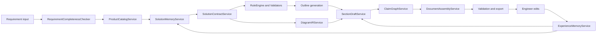
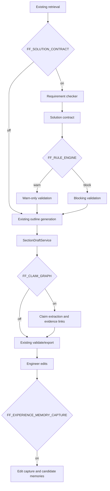
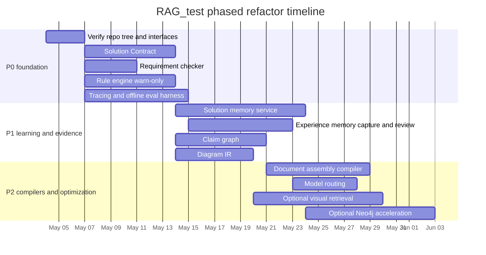

# Deep Refactor Plan for RAG_test

## Executive summary

This system should be refactored as a **proposal-engineering workflow**, not as “a better prompt on top of a better retriever.” The core upgrade is to insert a **structured solution-design layer** between retrieval and writing: requirement completeness checking, a typed **Solution Contract** as the system’s intermediate representation, a deterministic **rule/validation gate**, a lightweight **solution memory graph** inspired by M-flow’s path-based retrieval, and an **experience memory** loop that turns engineer edits into reusable knowledge. That direction is more aligned with official guidance from model vendors and framework authors than a fully autonomous agent design: OpenAI’s Structured Outputs are specifically intended for reliable schema-conforming application layers, Anthropic explicitly recommends starting with simple, composable workflows before adding agentic complexity, LangGraph/LangMem frame long-term memory in semantic/episodic/procedural layers, and Qdrant’s official hybrid and multi-stage query APIs are designed for exactly the sort of dense+sparse+metadata pipelines you need here. citeturn16search0turn16search1turn16search3turn31search0turn26search1turn26search2turn16search2turn30search1turn30search2

The most important recommendation is **not** to do a big-bang rewrite on `main`. Keep `main` release-stable. Use `product-driven-solution-20260419` as the primary integration branch for the deep refactor, and treat `codex/next-iteration-optimization-20260419` as a donor branch for retrieval, eval, and observability improvements that can be cherry-picked safely. The first three must-have refactors are: **Solution Contract**, **Rule Engine / Validators**, and **Eval + Tracing**. Without those, every downstream optimization—memory, graph retrieval, diagram generation, model routing—will remain hard to validate and easy to regress. OpenAI’s eval best-practice guidance and LangSmith’s offline/online evaluation model both strongly support introducing evaluation early, not after the architecture is already complicated. citeturn25search3turn17search2turn32search0turn32search3

A direct integration of entity["organization","FlowElement-ai","github org"]’s M-flow is **not** the right first move. M-flow’s public docs describe a full memory-engine stack with API routers, adapters, retrieval algorithms, auth, frontend, MCP server, and multiple database backends, and its retrieval model is built around graph-routed bundle search over an `Episode → Facet → FacetPoint → Entity` topology with semantic edges and minimum-cost path scoring. Those ideas are excellent and worth borrowing, but the project is significantly broader than your proposal-generation system. The right move is to implement **M-flow-lite** in your own codebase: keep Postgres as the truth layer, keep or adopt Qdrant as the primary vector layer, and add a lightweight `solution_patterns / solution_facets / solution_facet_points / solution_edges` memory graph that feeds your existing composition pipeline. citeturn27view0turn28view0turn29view1turn29view3turn22search0

One important limitation: I could not directly clone or fully browse the three GitHub branches from this environment. The only directly accessible in-session repository artifact was the uploaded `product_driven_solution_plan.md.resolved`, which references concrete repo paths and branch intent. Accordingly, this report distinguishes between **verified from the accessible branch artifact**, **inferred from prior discussion/branch naming**, and **proposed target locations** that should be verified against the actual repo tree on the first refactor day. Where official external capabilities and implementation choices are discussed, I cite primary sources.

## Repository state and evidence basis

The three branch roots referenced by your request are:

| Branch | Intended role in this plan | Link |
|---|---|---|
| `main` | Stable MVP / release branch | [main](https://github.com/withoutdelay/RAG_test/tree/main) |
| `codex/next-iteration-optimization-20260419` | Retrieval-quality / optimization donor branch | [codex/next-iteration-optimization-20260419](https://github.com/withoutdelay/RAG_test/tree/codex%2Fnext-iteration-optimization-20260419) |
| `product-driven-solution-20260419` | Primary deep-refactor branch | [product-driven-solution-20260419](https://github.com/withoutdelay/RAG_test/tree/product-driven-solution-20260419) |

The highest-confidence repository facts available to me came from the accessible product-driven branch design artifact. That artifact explicitly describes the current baseline flow as:

```text
create_project → retrieve_evidence → generate_outline → generate_sections → validate → export
```

and explicitly names the retained services or seams as:

- `SectionDraftService`
- `CaseLibraryService`
- `AssetRetrievalService`
- `block_taxonomy`
- `quality_gate`
- `validation`

It also explicitly proposes these additions:

- `ProductCatalogService`
- `SolutionDesignAgent`
- `DiagramGenerator`

and references concrete repo locations such as:

- `backend/app/api/products.py`
- `backend/app/api/composition.py`
- `backend/app/services/composition/solution_agent.py`
- `backend/app/services/composition/diagram_generator.py`
- `backend/app/services/retrieval/product_service.py`
- `validation/service.py`
- `domain/synonyms.py`

The artifact also states that Postgres is already present and that the product-driven plan should be additive rather than a framework rewrite.

That yields the following confidence map:

| Area | Confidence | Basis |
|---|---:|---|
| Baseline pipeline exists with retrieval → outline → sections → validate → export | High | Accessible product-driven branch artifact |
| `SectionDraftService`, `CaseLibraryService`, `AssetRetrievalService` are real design anchors | High | Accessible artifact |
| Product-driven branch intends to add `ProductCatalogService`, `SolutionDesignAgent`, `DiagramGenerator` | High | Accessible artifact |
| Exact file/class names in actual branch code | Medium | Referenced in artifact, but not directly code-verified here |
| Exact current retrieval implementation, vector DB, embeddings, rerankers | Low | Not directly accessible here |
| Exact ORM/migration stack | Low to medium | Postgres is stated; exact code not directly accessible |
| Exact contents of `codex/next-iteration-optimization-20260419` | Low | Not directly accessible; prior discussion only |
| Exact contents of `main` branch code tree | Low | Not directly accessible; inferred baseline only |

The accessible product-driven artifact is also valuable because it already gives you the right architectural seam: it proposes injecting `solution_context` into the section-generation context builder rather than replacing the whole document pipeline. That is exactly the seam you should preserve during the refactor.

The practical takeaway is that **your deep refactor should be interface-first**. You do not need to know every class implementation to define the right contract boundaries now. The right first step inside the real repository is a one-day code audit to verify the exact filenames, imports, service constructors, and migration conventions, then land the refactor in additive slices.

A good first-hour local verification script is:

```bash
git fetch origin --all --prune

for b in \
  main \
  'codex/next-iteration-optimization-20260419' \
  product-driven-solution-20260419
do
  echo "===== $b ====="
  git checkout "$b"
  git pull --ff-only || true
  tree -L 4 backend/app || true
  rg -n "SectionDraftService|CaseLibraryService|AssetRetrievalService|ProductCatalogService|SolutionDesignAgent|DiagramGenerator|Qdrant|pgvector|neo4j|alembic|SQLAlchemy|FastAPI|embedding|rerank|retriev" .
done
```

The product-driven artifact already references or implies these repo paths as the most important future touch points. They are the right targets for the deep refactor even before the tree is fully verified:

| Path | Branch | Status | Why it matters |
|---|---|---:|---|
| `backend/app/api/composition.py` | product-driven | referenced | orchestration entry point |
| `backend/app/api/products.py` | product-driven | referenced | product catalog CRUD/query seam |
| `backend/app/services/composition/solution_agent.py` | product-driven | referenced | current product-driven planning seam |
| `backend/app/services/composition/diagram_generator.py` | product-driven | referenced | diagram generation seam |
| `backend/app/services/retrieval/product_service.py` | product-driven | referenced | candidate product retrieval seam |
| `backend/app/services/composition/section_service.py` or equivalent | baseline/product-driven | inferred from artifact text | the key draft-generation integration seam |
| `validation/service.py` | baseline/product-driven | referenced | validator insertion point |
| `domain/synonyms.py` | baseline/product-driven | referenced | glossary / terminology / alias expansion seam |
| `backend/app/models/` or equivalent migrations | baseline/product-driven | referenced | schema additions for product and memory layers |

## Architecture gaps and target state

The product-driven branch already improves the architecture by moving from “retrieve old prose, then rewrite it” toward “choose products, then design a solution, then write.” That is directionally correct. But the artifact’s `solution_context` is still an **IR-lite** object. It is useful, but it is not yet a **first-class, schema-validated, evidence-aware Solution Contract**.

This is the most important gap. OpenAI’s Structured Outputs are specifically designed so the application can require schema-conforming outputs, rather than merely valid JSON; that is a strong fit for long-document proposal systems where the planning output must become machine-checked input for later stages. citeturn16search0turn16search1turn16search3

The second major gap is **deterministic engineering validation**. Your artifact sensibly proposes adding product-parameter consistency checks. That should be expanded into a broader rule engine. This is especially important because OpenAI’s official reasoning guidance emphasizes that reasoning models are strong at ambiguous and cross-document problems, but they are still not substitutes for deterministic verification; reasoning models should be used where ambiguity exists, while hard constraints and toolable checks should stay outside the model. citeturn30search0

The third major gap is **persistent, reviewable memory**. LangGraph and LangMem both distinguish semantic, episodic, and procedural memory, and also distinguish hot-path memory creation from deferred/background memory creation. That is exactly the shape you need for this system: semantic memory for product facts and terminology; episodic memory for prior approved solutions and edit histories; procedural memory for writing rules, banned phrases, section patterns, and client-specific style. citeturn26search1turn26search2turn25search1

The fourth gap is **graph-shaped solution memory**, which is where M-flow-lite fits. M-flow’s public retrieval docs are useful because they articulate three ideas that matter directly to proposal generation: retrieval should enter at the finest-grain matching points; edges themselves should carry semantics; and the relevance of a bundle should come from the strongest path, not an average of all paths. That is exactly the right conceptual model for “product + configuration + chapter + diagram + constraints” retrieval in an engineering proposal system. citeturn28view0turn27view0

The fifth gap is **claim-level evidence**, not just chunk citations. RAGChecker’s official repo emphasizes claim-level entailment and diagnostic retriever/generator metrics. For your domain, that means every product recommendation, engineering parameter, interface statement, and constraint should become a tracked claim with linked evidence. citeturn4search2

The sixth gap is **diagram objectification**. The artifact correctly rejects KiCad for this domain and prefers Mermaid, D2, draw.io XML, or SVG templating. The next step is to stop asking the model to generate Mermaid directly and instead force it to emit a `diagram_ir` object that can then be rendered into Mermaid or draw.io XML.

The seventh gap is **document assembly**. Right now the system appears to still conceptualize long-form generation largely as “draft text section by section.” The more robust approach is a block compiler: use templates, approved snippets, parameterized blocks, tables, diagrams, and generated transitions as typed components.

The eighth and ninth gaps are **eval** and **observability**. LangSmith’s official docs support both offline and online evaluation, multiple evaluator types, trace metadata, and production observability. Those are not optional on a long-document engineering system. They are the only sustainable way to prove that the system is actually becoming more accurate and reducing engineer effort over time. citeturn17search2turn32search0turn32search2turn32search3

The tenth gap is **task-based model routing**. OpenAI’s reasoning guidance is clear that reasoning models and general GPT models should be used differently. In your system, planner/reviewer tasks belong on a reasoning-capable model; deterministic rewriting, formatting, and section prose assembly can use a cheaper, faster model. citeturn30search0

The target state should look like this:



A concise gap matrix is below:

| Capability | Current state | Recommended target | Ship in |
|---|---|---|---:|
| Solution IR | `solution_context` only | strict `SolutionContract` | P0 |
| Requirement completeness checker | absent | gated completeness + clarifying questions | P0 |
| Rule engine | partial parameter validation | warn/block engineering rules + coverage checks | P0 |
| Solution memory graph | absent | M-flow-lite patterns/facets/edges | P1 |
| Experience memory | absent | edit capture → review → memory reuse | P1 |
| Claim-level evidence graph | absent | claims + evidence links + validation | P1 |
| `diagram_ir` | absent | typed diagram IR + renderer layer | P1 |
| Document assembly compiler | absent | blocks/snippets/templates/transitions | P2 |
| Eval factory | absent/unspecified | offline + online + golden datasets | P0 |
| Observability/tracing | absent/unspecified | trace every generation/tool/retrieval/edit | P0 |
| Model routing | absent | planner/reviewer vs writer/router split | P2 |

## Concrete code and schema changes

The correct refactor is to **promote** the artifact’s `solution_context` into a durable, typed contract, then make every later stage consume that contract rather than free-form prompt context.

The first change is a new typed schema module:

| File | Action | Purpose |
|---|---|---|
| `backend/app/schemas/solution_contract.py` | add | Pydantic models / JSON schema for the plan IR |
| `backend/app/services/composition/solution_contract_service.py` | add | generate + validate solution contracts |
| `backend/app/services/requirements/completeness_checker.py` | add | detect missing fields and clarifying questions |
| `backend/app/services/validation/rule_engine.py` | add | deterministic rules and severity handling |
| `backend/app/services/composition/section_service.py` | change | consume `SolutionContract`, not raw product prose |
| `backend/app/api/composition.py` | change | expose contract-generation and shadow-mode usage |

A minimal `SolutionContract` should look like this:

```json
{
  "requirement_brief": {
    "industry": "steel",
    "application": "blast furnace blower",
    "voltage_level": "10kV",
    "motor_type": "synchronous",
    "power_kw": 4500,
    "operation_mode": "soft_start_then_bypass",
    "control_system": "DCS",
    "communication_protocol": "Profibus-DP"
  },
  "completeness": {
    "score": 0.78,
    "missing_critical_fields": [
      "existing_excitation_reuse",
      "bypass_switching_disturbance_requirement"
    ],
    "clarifying_questions": [
      "Will the existing excitation system be reused?",
      "Is disturbance-free bypass switching required?"
    ]
  },
  "solution_strategy": {
    "primary_topology": "LCI_soft_start_plus_bypass",
    "reasoning": [
      "Suitable for high-power synchronous motor soft start",
      "Matches bypass-after-start operating mode"
    ]
  },
  "selected_products": [
    {
      "role": "main_drive",
      "series_code": "lci_series",
      "config": "bypass",
      "quantity": 2,
      "fit_score": 0.93,
      "required_components": [
        "rectifier_transformer",
        "excitation_cabinet",
        "bypass_cabinet"
      ],
      "evidence_paths": [
        {
          "path_type": "solution_memory",
          "path_nodes": [
            "requirement:synchronous_motor",
            "facet_point:soft_start_bypass",
            "solution_pattern:lci_sync_soft_start",
            "product:lci_series"
          ],
          "edge_texts": [
            "LCI soft start is recommended for large synchronous motor start scenarios",
            "Bypass cabinet is required when post-start line-frequency operation is requested"
          ],
          "confidence": "high"
        }
      ]
    }
  ],
  "section_contracts": [
    {
      "section_type": "overall_solution",
      "must_include": [
        "system composition",
        "start phase",
        "bypass phase",
        "communication interface"
      ],
      "must_not_include": [
        "continuous_speed_regulation_language"
      ]
    }
  ],
  "diagram_ir": {
    "diagram_type": "system_topology",
    "nodes": [],
    "edges": []
  },
  "claims": [],
  "open_questions": [],
  "risks": []
}
```

This design choice is directly supported by OpenAI’s Structured Outputs guidance: strict schema-conforming outputs are more reliable than JSON mode, and all required fields should be defined explicitly. citeturn16search0turn16search3

The second change is to add **solution memory graph** tables. This is where M-flow-lite lives.

```sql
CREATE TABLE solution_patterns (
    id UUID PRIMARY KEY DEFAULT gen_random_uuid(),
    tenant_id UUID NOT NULL,
    name TEXT NOT NULL,
    code TEXT UNIQUE,
    pattern_type TEXT NOT NULL,            -- standard_solution | historical_case | config_template
    industry TEXT,
    application TEXT,
    voltage_levels TEXT[] DEFAULT '{}',
    motor_types TEXT[] DEFAULT '{}',
    power_range_kw NUMRANGE,
    summary TEXT,
    reviewed_status TEXT DEFAULT 'draft',  -- draft | reviewed | deprecated
    embedding_ref TEXT,                    -- qdrant point id or external embedding key
    source_doc_ids UUID[] DEFAULT '{}',
    metadata JSONB DEFAULT '{}',
    created_at TIMESTAMPTZ DEFAULT now(),
    updated_at TIMESTAMPTZ DEFAULT now()
);

CREATE TABLE solution_facets (
    id UUID PRIMARY KEY DEFAULT gen_random_uuid(),
    pattern_id UUID NOT NULL REFERENCES solution_patterns(id) ON DELETE CASCADE,
    facet_type TEXT NOT NULL,              -- applicability | product_config | interface | protection | diagrams | risks
    title TEXT NOT NULL,
    summary TEXT,
    embedding_ref TEXT,
    source_section_ids UUID[] DEFAULT '{}',
    metadata JSONB DEFAULT '{}',
    created_at TIMESTAMPTZ DEFAULT now()
);

CREATE TABLE solution_facet_points (
    id UUID PRIMARY KEY DEFAULT gen_random_uuid(),
    facet_id UUID NOT NULL REFERENCES solution_facets(id) ON DELETE CASCADE,
    point_type TEXT NOT NULL,              -- fact | rule | constraint | rationale | warning | parameter
    content TEXT NOT NULL,
    normalized_key TEXT,
    value JSONB DEFAULT '{}',
    confidence TEXT DEFAULT 'medium',
    embedding_ref TEXT,
    source_doc_id UUID,
    source_section_id UUID,
    source_spans JSONB DEFAULT '[]',
    reviewed_by UUID,
    reviewed_at TIMESTAMPTZ,
    metadata JSONB DEFAULT '{}',
    created_at TIMESTAMPTZ DEFAULT now()
);

CREATE TABLE solution_edges (
    id UUID PRIMARY KEY DEFAULT gen_random_uuid(),
    tenant_id UUID NOT NULL,
    source_type TEXT NOT NULL,             -- product_series | solution_pattern | facet | facet_point | section | figure_asset
    source_id UUID NOT NULL,
    target_type TEXT NOT NULL,
    target_id UUID NOT NULL,
    relation TEXT NOT NULL,                -- recommended_for | requires | compatible_with | conflicts_with | has_figure | evidenced_by
    edge_text TEXT NOT NULL,
    condition TEXT,
    severity TEXT DEFAULT 'normal',        -- normal | warning | blocking
    confidence TEXT DEFAULT 'medium',
    embedding_ref TEXT,
    source_doc_id UUID,
    source_section_id UUID,
    source_spans JSONB DEFAULT '[]',
    metadata JSONB DEFAULT '{}',
    created_at TIMESTAMPTZ DEFAULT now(),
    updated_at TIMESTAMPTZ DEFAULT now()
);

CREATE INDEX idx_solution_patterns_tenant ON solution_patterns (tenant_id);
CREATE INDEX idx_solution_patterns_scope ON solution_patterns (industry, application);
CREATE INDEX idx_solution_edges_src ON solution_edges (source_type, source_id);
CREATE INDEX idx_solution_edges_tgt ON solution_edges (target_type, target_id);
```

These tables deliberately mirror the M-flow ideas that are most valuable here: `Episode/Facet/FacetPoint/Entity`-style multi-granular retrieval, semantic edges, and strongest-path scoring—without importing M-flow’s entire memory-engine platform. M-flow’s own public docs explicitly describe graph-routed bundle search, semantic edges, minimum-cost path scoring, and a much broader system footprint with API, adapters, memory processing, retrieval, pipeline, auth, frontend, MCP, and worker subsystems. citeturn28view0turn29view1turn29view3

The third change is an **experience memory** subsystem, which should be additive and review-gated from the start.

```sql
CREATE TABLE generation_runs (
    id UUID PRIMARY KEY DEFAULT gen_random_uuid(),
    tenant_id UUID NOT NULL,
    project_id UUID,
    document_id UUID,
    section_id UUID,
    section_type TEXT,
    requirement_brief JSONB NOT NULL DEFAULT '{}',
    solution_contract JSONB DEFAULT '{}',
    retrieved_evidence JSONB DEFAULT '[]',
    recalled_memories JSONB DEFAULT '[]',
    model_route TEXT,
    prompt_version TEXT,
    generated_text TEXT,
    generated_artifacts JSONB DEFAULT '[]',
    trace_id TEXT,
    cost_json JSONB DEFAULT '{}',
    created_at TIMESTAMPTZ DEFAULT now()
);

CREATE TABLE edit_events (
    id UUID PRIMARY KEY DEFAULT gen_random_uuid(),
    generation_run_id UUID NOT NULL REFERENCES generation_runs(id) ON DELETE CASCADE,
    tenant_id UUID NOT NULL,
    editor_id UUID,
    edit_level TEXT NOT NULL,              -- document | section | paragraph | sentence | diagram
    before_text TEXT,
    after_text TEXT,
    before_artifact JSONB DEFAULT '{}',
    after_artifact JSONB DEFAULT '{}',
    diff_summary TEXT,
    edit_reason TEXT,
    metadata JSONB DEFAULT '{}',
    created_at TIMESTAMPTZ DEFAULT now()
);

CREATE TABLE memory_candidates (
    id UUID PRIMARY KEY DEFAULT gen_random_uuid(),
    edit_event_id UUID NOT NULL REFERENCES edit_events(id) ON DELETE CASCADE,
    tenant_id UUID NOT NULL,
    memory_type TEXT NOT NULL,             -- semantic | episodic | procedural | negative
    title TEXT,
    content TEXT NOT NULL,
    applies_to JSONB DEFAULT '{}',
    recall_query TEXT,
    confidence TEXT DEFAULT 'medium',
    risk_level TEXT DEFAULT 'medium',
    scope_suggestion TEXT DEFAULT 'project', -- project | customer | team | tenant | product_line
    source_trace JSONB DEFAULT '{}',
    status TEXT DEFAULT 'pending',         -- pending | approved | rejected | merged
    created_at TIMESTAMPTZ DEFAULT now()
);

CREATE TABLE experience_memories (
    id UUID PRIMARY KEY DEFAULT gen_random_uuid(),
    tenant_id UUID NOT NULL,
    scope TEXT NOT NULL,                   -- project | customer | team | tenant | product_line
    memory_type TEXT NOT NULL,
    title TEXT,
    content TEXT NOT NULL,
    applies_to JSONB DEFAULT '{}',
    priority INT DEFAULT 50,
    confidence TEXT DEFAULT 'medium',
    embedding_ref TEXT,
    source_edit_ids UUID[] DEFAULT '{}',
    source_doc_ids UUID[] DEFAULT '{}',
    source_section_ids UUID[] DEFAULT '{}',
    reviewed_by UUID,
    reviewed_at TIMESTAMPTZ,
    status TEXT DEFAULT 'active',
    valid_from TIMESTAMPTZ DEFAULT now(),
    valid_until TIMESTAMPTZ,
    metadata JSONB DEFAULT '{}',
    created_at TIMESTAMPTZ DEFAULT now(),
    updated_at TIMESTAMPTZ DEFAULT now()
);

CREATE TABLE memory_applications (
    id UUID PRIMARY KEY DEFAULT gen_random_uuid(),
    memory_id UUID NOT NULL REFERENCES experience_memories(id) ON DELETE CASCADE,
    generation_run_id UUID NOT NULL REFERENCES generation_runs(id) ON DELETE CASCADE,
    applied_location TEXT,
    effect_summary TEXT,
    user_accepted BOOLEAN,
    user_feedback TEXT,
    created_at TIMESTAMPTZ DEFAULT now()
);
```

This maps directly onto LangGraph/LangMem’s conceptual model: semantic memory for facts, episodic memory for prior cases and edits, procedural memory for stable instructions and writing rules, plus explicit decisions about hot-path versus background memory formation. citeturn26search1turn26search2turn25search1

The fourth change is **claim-level evidence**:

```sql
CREATE TABLE claims (
    id UUID PRIMARY KEY DEFAULT gen_random_uuid(),
    generation_run_id UUID NOT NULL REFERENCES generation_runs(id) ON DELETE CASCADE,
    tenant_id UUID NOT NULL,
    section_id UUID,
    claim_type TEXT NOT NULL,              -- product_recommendation | parameter | interface | constraint | risk
    claim_text TEXT NOT NULL,
    normalized_claim TEXT,
    support_status TEXT DEFAULT 'unknown', -- supported | unsupported | partial
    confidence TEXT DEFAULT 'medium',
    risk_level TEXT DEFAULT 'medium',
    created_at TIMESTAMPTZ DEFAULT now()
);

CREATE TABLE claim_evidence_links (
    id UUID PRIMARY KEY DEFAULT gen_random_uuid(),
    claim_id UUID NOT NULL REFERENCES claims(id) ON DELETE CASCADE,
    source_doc_id UUID,
    source_section_id UUID,
    source_spans JSONB DEFAULT '[]',
    evidence_text TEXT,
    score NUMERIC,
    evidence_type TEXT DEFAULT 'retrieved_chunk', -- retrieved_chunk | product_rule | memory_edge | manual_reference
    created_at TIMESTAMPTZ DEFAULT now()
);
```

The fifth change is **diagram IR**. The code split should be:

| File | Action | Purpose |
|---|---|---|
| `backend/app/schemas/diagram_ir.py` | add | typed intermediate diagram representation |
| `backend/app/services/composition/diagram_ir_service.py` | add | plan diagrams from `SolutionContract` |
| `backend/app/services/renderers/mermaid_renderer.py` | add | render Mermaid |
| `backend/app/services/renderers/drawio_renderer.py` | add | render draw.io XML |
| `backend/app/services/composition/diagram_generator.py` | change | become orchestration layer, not direct LLM-to-Mermaid |

The sixth change is **document assembly**. Minimal P2 tables:

```sql
CREATE TABLE section_blocks (
    id UUID PRIMARY KEY DEFAULT gen_random_uuid(),
    tenant_id UUID NOT NULL,
    block_type TEXT NOT NULL,              -- approved_snippet | template | parameterized_block | generated_transition | table_block | figure_block
    section_type TEXT NOT NULL,
    title TEXT,
    body_md TEXT NOT NULL,
    variables JSONB DEFAULT '[]',
    applicability JSONB DEFAULT '{}',
    reviewed_status TEXT DEFAULT 'draft',
    embedding_ref TEXT,
    source_doc_ids UUID[] DEFAULT '{}',
    metadata JSONB DEFAULT '{}',
    created_at TIMESTAMPTZ DEFAULT now(),
    updated_at TIMESTAMPTZ DEFAULT now()
);
```

The seventh change is **tracing and model routing**:

| File | Action | Purpose |
|---|---|---|
| `backend/app/observability/tracing.py` | add | generation/retrieval/tool/edit tracing |
| `backend/app/llm/router.py` | add | task → model mapping |
| `backend/app/llm/clients/...` | change | structured output + tool wrappers |
| `backend/evals/` | add | offline regression harness |

The preferred task routing is:

| Task | Model class |
|---|---|
| Requirement completeness, solution planning, technical review | reasoning-capable model |
| Section prose drafting, small rewrites, formatting | lower-cost GPT-style model |
| Memory extraction and candidate generation | mid-cost model |
| Diagram rendering | no model |
| Validation | mostly deterministic code |

That division is exactly the sort of split OpenAI recommends between reasoning models and general GPT models. citeturn30search0

The most important API contracts to add are these.

**Generate a Solution Contract**

```json
POST /api/v1/composition/{project_id}/solution-contract:generate

{
  "requirement_cards": {
    "industry": "steel",
    "application": "blast furnace blower",
    "motor": {
      "type": "synchronous",
      "voltage": "10kV",
      "power_kw": 4500,
      "quantity": 2
    },
    "requirements": [
      "soft start",
      "bypass after synchronization",
      "Profibus-DP to DCS"
    ]
  },
  "feature_flags": {
    "requirement_check": true,
    "solution_memory": true,
    "rule_validation": "warn"
  }
}
```

```json
200 OK

{
  "solution_contract_id": "uuid",
  "status": "ok",
  "solution_contract": { "...": "..." },
  "validation_report": {
    "errors": [],
    "warnings": [
      {
        "code": "REQ_MISSING_002",
        "message": "Existing excitation reuse is unspecified"
      }
    ]
  }
}
```

**Capture an engineer edit**

```json
POST /api/v1/feedback/edit-events

{
  "generation_run_id": "uuid",
  "edit_level": "section",
  "section_type": "overall_solution",
  "before_text": "system generated text ...",
  "after_text": "engineer approved text ...",
  "edit_reason": "should describe LCI soft start plus bypass instead of continuous speed regulation"
}
```

**Review and promote memory candidates**

```json
POST /api/v1/memory/review

{
  "memory_candidate_ids": ["uuid1", "uuid2"],
  "decisions": [
    {
      "candidate_id": "uuid1",
      "action": "approve",
      "scope": "product_line"
    },
    {
      "candidate_id": "uuid2",
      "action": "reject"
    }
  ]
}
```

The corresponding prompts should also change.

**Solution Contract prompt**

```text
System:
You are the solution planner for industrial electrical proposal generation.
Return ONLY JSON matching the provided schema.
Do not invent unsupported product capabilities.
When requirements are incomplete, do not guess silently:
1) list missing critical fields,
2) list clarifying questions,
3) mark assumptions explicitly with confidence.

User:
Generate a Solution Contract for the following requirement and candidate set.

<requirement_cards>
...
</requirement_cards>

<candidate_products>
...
</candidate_products>

<retrieved_evidence>
...
</retrieved_evidence>

<recalled_solution_memories>
...
</recalled_solution_memories>

Schema rules:
- all fields are required
- evidence_paths must be present for each selected product
- section_contracts must be included
- diagram_ir must be included even if empty
```

**Memory extraction prompt**

```text
System:
You are the feedback-learning module for an industrial proposal system.
Given a generated draft and the engineer-approved revision, extract reusable memories.
Do not merely restate the revised text.
Produce memory candidates of these types only:
semantic, episodic, procedural, negative.

Rules:
- product facts, parameters, and engineering constraints are high-risk and require review
- style preferences and banned phrases may be lower risk
- suggest the narrowest valid scope: project, customer, team, tenant, or product_line
- include recall triggers and applicability filters

User:
<section_type>overall_solution</section_type>
<requirement_brief>...</requirement_brief>
<before_text>...</before_text>
<after_text>...</after_text>
<edit_reason>...</edit_reason>
<supporting_evidence>...</supporting_evidence>

Return JSON with:
candidates[].memory_type
candidates[].title
candidates[].content
candidates[].applies_to
candidates[].scope_suggestion
candidates[].recall_query
candidates[].risk_level
candidates[].confidence
```

## Safe integration and migration plan

The safest way to land this refactor is **not** to replace the current generation pipeline. It is to add a new design and memory plane **in parallel**, hidden behind feature flags, and let the current section-generation path continue to function until the new path wins on evals.

The integration strategy should be:



The feature-flag set should be explicit and environment-controlled.

| Flag | Default | Purpose |
|---|---:|---|
| `FF_REQUIREMENT_CHECK` | off | enable completeness checker |
| `FF_SOLUTION_CONTRACT` | off | generate contract before outline |
| `FF_RULE_ENGINE_MODE` | `off` | `off` / `warn` / `block` |
| `FF_SOLUTION_MEMORY_SHADOW` | off | retrieve solution memory but do not apply |
| `FF_SOLUTION_MEMORY_ACTIVE` | off | apply solution memory in selection |
| `FF_EXPERIENCE_MEMORY_CAPTURE` | off | create generation runs and edit events |
| `FF_EXPERIENCE_MEMORY_APPLY` | off | recall approved memories into drafts |
| `FF_CLAIM_GRAPH` | off | claim extraction and evidence linking |
| `FF_DIAGRAM_IR` | off | generate diagram IR and render artifacts |
| `FF_ASSEMBLY_COMPILER` | off | assemble blocks instead of free drafting |
| `FF_MODEL_ROUTER` | off | task-dependent model routing |

The migrations should be landed in this sequence:

| Step | Change type | Safe because |
|---|---|---|
| Additive schema migrations | tables only, no behavior | no existing code path changes |
| Generation tracing | write-only logging | does not change outputs |
| Edit capture | write-only logging | only active on save/approve actions |
| Requirement checker | shadow mode | can log missing-field diagnostics only |
| Solution contract | shadow mode | compare against existing `solution_context` |
| Rule engine | warn-only | no blocked runs yet |
| Solution memory | shadow retrieval | log bundle results for offline comparison |
| Claim graph | non-blocking | compare evidence coverage first |
| Experience memory apply | low-risk modes first | procedural + negative only |
| Blocking validators | only after measured success | controlled rollout |

Repository-safe POC mapping is below.

| Capability | Minimal POC | Primary files |
|---|---|---|
| Solution Contract | one endpoint, one schema, one prompt, one validator | `backend/app/schemas/solution_contract.py`, `backend/app/services/composition/solution_contract_service.py`, `backend/app/api/composition.py` |
| Requirement checker | score + questions only | `backend/app/services/requirements/completeness_checker.py` |
| Rule engine | 20 YAML rules, warn-only | `backend/app/services/validation/rule_engine.py`, `validation/service.py`, `backend/app/validation/rules/*.yaml` |
| Solution memory | 30 solution patterns + 100 edges + ranker | `backend/app/services/composition/solution_memory_service.py`, Alembic migration |
| Experience memory | capture edit diff + manual review queue | `backend/app/services/memory/experience_memory_service.py`, `backend/app/api/feedback.py` |
| Claim graph | extract only product and parameter claims | `backend/app/services/evidence/claim_graph_service.py` |
| Diagram IR | system topology only | `backend/app/schemas/diagram_ir.py`, `backend/app/services/composition/diagram_ir_service.py` |
| Eval factory | 20 golden cases + offline runner | `backend/evals/` |
| Tracing | request-level and stage-level traces | `backend/app/observability/tracing.py` |

Your first test suite should be split into four layers:

| Test layer | Focus |
|---|---|
| Unit | schema validation, rule logic, diff classification, path scoring |
| Integration | endpoint behavior, migrations, Qdrant/Postgres adapters, export |
| Golden regression | requirement → contract → section output vs approved baseline |
| Online observation | real runs, edit distance, warning rates, acceptance rate |

LangSmith is a strong default for tracing and eval because it supports offline/online evaluation, human review, code rules, LLM-as-judge, trace metadata, project organization, and production monitoring. If you do not want a SaaS dependency, implement the same event model locally, but keep the schema compatible with later LangSmith export. citeturn17search2turn32search0turn32search2turn32search3

For retrieval and metadata filtering, Qdrant is a strong fit. Its official docs explicitly support hybrid and multi-stage queries through the Query API and `prefetch`, and its payload + payload-index design is ideal for fields like `tenant_id`, `doc_type`, `section_type`, `equipment_type`, `customer_id`, `review_status`, and `pattern_type`. Qdrant also recommends creating payload indexes early, because later creation can block updates and because HNSW indexing benefits when payload indexes already exist. citeturn16search2turn16search4turn30search1turn30search2

For the graph side, the recommended progression is:

| Option | Recommendation | Why |
|---|---|---|
| Full M-flow integration | No | too heavyweight for current system |
| M-flow-lite in Postgres + Qdrant | Yes | captures the right retrieval ideas with low disruption |
| Neo4j GraphRAG | Optional P2 | only if graph scale/complexity justifies dedicated graph DB |

That choice is grounded in publicly visible facts: M-flow itself is a larger memory-engine platform with multiple DB adapters and a much broader runtime surface, while Neo4j’s official GraphRAG stack is best suited when graph retrieval becomes a first-class platform capability rather than an augmentation to an existing proposal pipeline. citeturn29view1turn29view3turn22search0turn22search3

## Roadmap, metrics, and technology choices

The roadmap below assumes one strong backend engineer plus part-time product/domain support. If you have two engineers, the durations shorten materially because schema/eval/tracing and contract/rule work can be parallelized.

| Phase | Scope | Effort | Primary risks | Acceptance criteria |
|---|---|---:|---|---|
| P0 | Solution Contract, requirement checker, warn-only rule engine, tracing, offline eval harness | 6–8 person-weeks | branch realities differ from assumptions; schema churn | contract produced reliably; warn-only validator catches historical defects; offline eval harness operational |
| P1 | Solution memory graph, experience memory capture/review/apply, claim graph, diagram IR | 8–10 person-weeks | low-quality memory promotion; graph over-design | measurable selection improvement; edit-distance reduction; evidence coverage increase |
| P2 | document assembly compiler, model routing, optional visual retrieval, optional Neo4j acceleration | 8–12 person-weeks | unnecessary complexity; latency | better first-pass section acceptance; lower cost via routing; stable assembly behavior |

The phase priorities should be:

- **P0**: do these first, because they stabilize the architecture.
- **P1**: do these next, because they create durable learning and explainability.
- **P2**: do these only after you have metrics proving the earlier layers helped.

The most important acceptance metrics are these:

| Metric | Definition | Target |
|---|---|---:|
| Product selection accuracy | exact or F1 match between approved and generated main products + required components | +15 points vs current baseline |
| Chapter pass rate | percent of sections accepted without substantial rewrite | +20 points |
| Normalized edit distance | token- or sentence-level diff between first draft and approved final | -25% to -35% |
| Memory hit rate | approved memory retrieved on applicable repeated scenarios | >40% on repeated-customer scenarios |
| Memory precision | recalled memories judged helpful by engineers | >80% |
| Claim evidence coverage | key claims with at least one linked evidence record | >95% for parameters and recommendations |
| Repeated error rate | historically corrected defect reappears | -50% |
| Diagram acceptance | diagrams needing only minor visual edits | >70% for P1 topology/system diagrams |
| Validator catch rate | proportion of historically known defects flagged before review | >70% |
| Latency budget | contract + sections generation within acceptable SLA | establish baseline in P0, hold regression under 15% |

The offline eval harness should use a small but high-quality golden set before anything else. OpenAI’s best-practice guidance and LangSmith’s evaluation docs both support this workflow, and RAGChecker is a good additional tool because it emphasizes claim-level evaluation and retriever/generator diagnosis. citeturn25search3turn17search2turn4search2

A practical eval layout is:

```text
backend/evals/
  datasets/
    requirements.jsonl
    approved_contracts.jsonl
    approved_sections.jsonl
  rubrics/
    product_selection.yaml
    evidence_coverage.yaml
    banned_phrases.yaml
    diagram_quality.yaml
  runners/
    run_offline_eval.py
    compare_experiments.py
  reports/
    latest/
```

The recommended technology stack is:

| Layer | Recommended choice | Why | Alternative |
|---|---|---|---|
| Relational truth | Postgres | existing anchor, strong schemas, joins, auditability | none |
| Vector retrieval | Qdrant | hybrid multi-stage query support, payload filters and indexes | keep current vector store if already entrenched, but match Qdrant-like interface |
| Co-located vector search | pgvector optional | useful for smaller memory/index workloads in Postgres | external-only Qdrant |
| Graph retrieval | Postgres edge tables + in-process ranking | simplest M-flow-lite path | Neo4j in P2 |
| LLM orchestration | custom code-first workflow | lowest abstraction, easiest debugging | LangGraph if you specifically want graph state/checkpoints |
| Structured generation | OpenAI Structured Outputs or Anthropic tools | schema reliability | ad hoc JSON parsing should be avoided |
| Tracing/eval | LangSmith + local JSONL harness | strong primitive set plus portability | custom-only |
| Visual retrieval | ColQwen2 / ColPali optional P2 | page-image retrieval without OCR-first dependence | text-only retrieval for now |

The visual-retrieval recommendation is deliberately deferred. Official Hugging Face docs for ColQwen2 and Vidore’s ColPali show why these models are attractive for future diagram/table/page retrieval: they represent documents as visual objects, not just OCR text, and can capture layout and chart/table structure. But this is a **P2** improvement, not a prerequisite for the deep refactor. citeturn23search1turn23search2turn23search3

The phased timeline below is a good default if work starts in early May 2026:



The single most important implementation decision is this:

**Use `product-driven-solution-20260419` as the integration branch, but do not stop at product selection. Promote product selection into a strict Solution Contract, wrap it in validators, feed it with M-flow-lite solution memory, and close the loop with engineer-edit memory.**

That is the shortest path from “RAG document assistant” to “domain proposal system that actually gets better with use.”