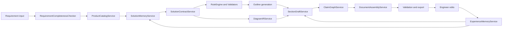
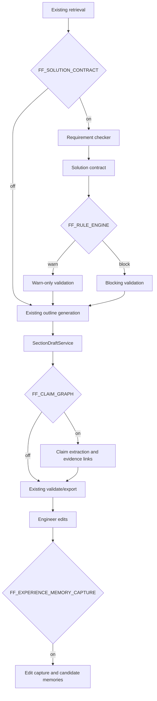
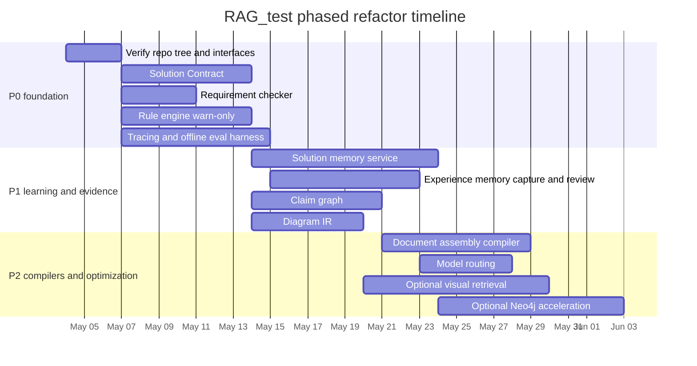

# RAG_test 深度重构计划

> 说明：本中文版基于 `deep-research-report.md` 翻译整理。原文中的 Deep Research 引用/实体控制标记在普通 Markdown 阅读器里容易显示为乱码；本文件已清理这些标记，同时保留正文结构、技术判断、代码块和实施建议。

## 执行摘要

这个系统不应该被重构成“更好的检索器上面套一个更好的提示词”，而应该被重构成一个**方案工程工作流**。核心升级方向是在检索和写作之间插入一个**结构化方案设计层**：需求完整性检查、作为系统中间表示的强类型 **Solution Contract**、确定性的**规则/校验门禁**、一个受 M-flow 路径式检索启发的轻量**方案记忆图谱**，以及一个把工程师修改沉淀成可复用知识的**经验记忆**闭环。

这个方向比“全自动 Agent”更符合模型厂商和框架作者的官方建议：OpenAI 的 Structured Outputs 适合构建可靠的、符合 schema 的应用层；Anthropic 明确建议先从简单、可组合的工作流开始，再逐步增加 Agent 复杂度；LangGraph/LangMem 把长期记忆分成语义、情节、程序三层；Qdrant 官方的混合检索和多阶段 Query API 正是为 dense + sparse + metadata 这类管线设计的。

最重要的建议是：**不要在 `main` 上做一次性大重写**。保持 `main` 可发布、稳定。把 `product-driven-solution-20260419` 作为深度重构的主集成分支，把 `codex/next-iteration-optimization-20260419` 作为检索、评测、可观测性改进的 donor branch，有选择地 cherry-pick 安全改动。

前三个必须优先做的重构是：**Solution Contract**、**Rule Engine / Validators**、**Eval + Tracing**。没有这些，后续所有优化，包括记忆、图谱检索、图纸生成、模型路由，都很难验证，也很容易回归。OpenAI 的 eval 最佳实践和 LangSmith 的离线/在线评测模型都支持“尽早引入评测”，而不是等架构复杂之后再补评测。

直接集成 FlowElement-ai 的 M-flow **不是第一步的正确选择**。M-flow 公开文档描述的是一个完整记忆引擎栈，包含 API router、adapter、检索算法、鉴权、前端、MCP server、多种数据库后端等；它的检索模型围绕 `Episode → Facet → FacetPoint → Entity` 拓扑做图路由 bundle search，边带语义，并用 minimum-cost path scoring。这个思想很有价值，值得借鉴，但 M-flow 项目范围显著大于你的方案生成系统。

正确做法是在自己的代码库里实现 **M-flow-lite**：保留 Postgres 作为事实层，保留或采用 Qdrant 作为主向量层，新增轻量的 `solution_patterns / solution_facets / solution_facet_points / solution_edges` 记忆图谱，为现有 composition pipeline 提供输入。

一个重要限制：报告作者无法从其环境直接 clone 或完整浏览三个 GitHub 分支。唯一可直接访问的仓库材料是上传的 `product_driven_solution_plan.md.resolved`，其中包含具体 repo 路径和分支意图。因此，本报告会区分：

- **已由可访问分支材料验证**
- **基于此前讨论/分支命名推断**
- **建议的目标位置，需在重构第一天对真实 repo tree 进行校验**

涉及外部能力和实现选择的部分，原报告引用了官方来源。

## 仓库状态与证据基础

你的请求中涉及的三个分支根是：

| 分支 | 本计划中的定位 | 链接 |
|---|---|---|
| `main` | 稳定 MVP / 发布分支 | [main](https://github.com/withoutdelay/RAG_test/tree/main) |
| `codex/next-iteration-optimization-20260419` | 检索质量 / 优化 donor branch | [codex/next-iteration-optimization-20260419](https://github.com/withoutdelay/RAG_test/tree/codex%2Fnext-iteration-optimization-20260419) |
| `product-driven-solution-20260419` | 深度重构主分支 | [product-driven-solution-20260419](https://github.com/withoutdelay/RAG_test/tree/product-driven-solution-20260419) |

最高置信度的仓库事实来自可访问的 product-driven 分支设计材料。该材料明确描述当前 baseline flow 为：

```text
create_project → retrieve_evidence → generate_outline → generate_sections → validate → export
```

并明确提到保留的服务或接口边界：

- `SectionDraftService`
- `CaseLibraryService`
- `AssetRetrievalService`
- `block_taxonomy`
- `quality_gate`
- `validation`

它还明确提出新增：

- `ProductCatalogService`
- `SolutionDesignAgent`
- `DiagramGenerator`

并引用了具体 repo 位置，例如：

- `backend/app/api/products.py`
- `backend/app/api/composition.py`
- `backend/app/services/composition/solution_agent.py`
- `backend/app/services/composition/diagram_generator.py`
- `backend/app/services/retrieval/product_service.py`
- `validation/service.py`
- `domain/synonyms.py`

该材料还说明 Postgres 已经存在，并且 product-driven 计划应该以增量方式推进，而不是做框架级重写。

由此可得以下置信度图：

| 领域 | 置信度 | 依据 |
|---|---:|---|
| baseline pipeline 存在 retrieval → outline → sections → validate → export | 高 | 可访问的 product-driven 分支材料 |
| `SectionDraftService`、`CaseLibraryService`、`AssetRetrievalService` 是真实设计锚点 | 高 | 可访问材料 |
| product-driven 分支计划新增 `ProductCatalogService`、`SolutionDesignAgent`、`DiagramGenerator` | 高 | 可访问材料 |
| 真实分支代码里的精确文件/类名 | 中 | 材料引用了路径，但未直接代码验证 |
| 当前检索实现、向量库、embedding、reranker 的细节 | 低 | 当前环境未直接访问 |
| ORM / migration 栈细节 | 低到中 | 已知使用 Postgres，但未直接访问代码 |
| `codex/next-iteration-optimization-20260419` 精确内容 | 低 | 仅来自此前讨论 |
| `main` 分支代码树精确内容 | 低 | 仅推断 baseline |

可访问的 product-driven 材料非常有价值，因为它已经给出了正确架构切入点：它建议把 `solution_context` 注入 section-generation context builder，而不是替换整个文档管线。重构时应该保留这个切入点。

实践结论是：**深度重构应该 interface-first**。现在不需要知道每个类的全部实现，也能先定义正确的 contract boundary。进入真实仓库后的第一步，应该用一天做代码审计，确认精确文件名、import、service constructor 和 migration 约定，然后用增量切片落地重构。

第一小时本地验证脚本建议：

```bash
git fetch origin --all --prune

for b in \
  main \
  'codex/next-iteration-optimization-20260419' \
  product-driven-solution-20260419
do
  echo "===== $b ====="
  git checkout "$b"
  git pull --ff-only || true
  tree -L 4 backend/app || true
  rg -n "SectionDraftService|CaseLibraryService|AssetRetrievalService|ProductCatalogService|SolutionDesignAgent|DiagramGenerator|Qdrant|pgvector|neo4j|alembic|SQLAlchemy|FastAPI|embedding|rerank|retriev" .
done
```

product-driven 材料已经引用或暗示以下 repo 路径是未来最重要的触点。即使在完整验证代码树之前，它们也是深度重构的正确目标：

| 路径 | 分支 | 状态 | 重要性 |
|---|---|---:|---|
| `backend/app/api/composition.py` | product-driven | 已引用 | orchestration 入口 |
| `backend/app/api/products.py` | product-driven | 已引用 | 产品目录 CRUD / 查询接口 |
| `backend/app/services/composition/solution_agent.py` | product-driven | 已引用 | 当前 product-driven 规划接口 |
| `backend/app/services/composition/diagram_generator.py` | product-driven | 已引用 | 图纸生成接口 |
| `backend/app/services/retrieval/product_service.py` | product-driven | 已引用 | 候选产品检索接口 |
| `backend/app/services/composition/section_service.py` 或等价文件 | baseline/product-driven | 根据材料文本推断 | 草稿生成的关键集成点 |
| `validation/service.py` | baseline/product-driven | 已引用 | validator 插入点 |
| `domain/synonyms.py` | baseline/product-driven | 已引用 | 术语 / 同义词 / alias expansion 接口 |
| `backend/app/models/` 或等价 migrations | baseline/product-driven | 已引用 | 产品层和记忆层的 schema 新增位置 |

## 架构缺口与目标状态

product-driven 分支已经把架构从“召回旧文本，然后改写”推进到“选择产品，然后设计方案，然后写作”。这个方向是正确的。但材料中的 `solution_context` 仍然只是一个 **IR-lite** 对象。它有用，但还不是一个**一等公民、schema 校验、证据感知的 Solution Contract**。

这是最重要的缺口。OpenAI 的 Structured Outputs 正是为了让应用层要求模型输出符合 schema，而不仅仅是合法 JSON；这非常适合长文档方案系统，因为规划输出必须成为后续阶段可机器校验的输入。

第二个主要缺口是**确定性工程校验**。材料合理提出了产品参数一致性检查，但这应该扩展成更广义的 rule engine。尤其重要的是，OpenAI 官方 reasoning 指南强调：reasoning model 擅长处理模糊和跨文档问题，但不能替代确定性校验。模型应该用于有歧义的地方，硬约束和可工具化检查应留在模型之外。

第三个主要缺口是**持久、可审阅的记忆**。LangGraph 和 LangMem 都区分语义记忆、情节记忆、程序记忆，也区分 hot-path memory creation 和 deferred/background memory creation。你的系统正好需要这种形状：

- semantic memory：产品事实、术语
- episodic memory：历史已批准方案和修改历史
- procedural memory：写作规则、禁用表述、章节模式、客户风格

第四个缺口是**图谱形态的方案记忆**，也就是 M-flow-lite 的位置。M-flow 公开检索文档里最值得借鉴的三个思想是：

1. 检索应该从最细粒度匹配点进入。
2. 边本身应该携带语义。
3. bundle 的相关性应该来自最强路径，而不是所有路径的平均值。

这正好适合工程方案生成里的“产品 + 配置 + 章节 + 图纸 + 约束”检索。

第五个缺口是**claim-level evidence**，而不仅是 chunk citation。RAGChecker 官方 repo 强调 claim-level entailment 和 retriever/generator 诊断指标。对于你的领域，这意味着每个产品推荐、工程参数、接口说明和约束都应成为可追踪 claim，并链接证据。

第六个缺口是**图纸对象化**。材料正确地否定了 KiCad 这类电路级工具，更倾向 Mermaid、D2、draw.io XML 或 SVG template。下一步不是让模型直接生成 Mermaid，而是强制模型输出 `diagram_ir` 对象，然后再渲染成 Mermaid 或 draw.io XML。

第七个缺口是**文档组装**。当前系统似乎仍把长文档生成理解为“逐章生成文本”。更稳的方式是 block compiler：把模板、已批准片段、参数化 block、表格、图纸和生成的转接段作为 typed components 组装。

第八和第九个缺口是 **eval** 和**可观测性**。LangSmith 官方文档支持离线/在线评测、多种 evaluator、trace metadata、生产可观测性。对长文档工程系统而言，这些不是可选项。它们是证明系统确实在变准确、确实减少工程师工作量的唯一可持续方法。

第十个缺口是**基于任务的模型路由**。OpenAI reasoning 指南明确说明 reasoning models 和 general GPT models 应该有不同使用方式。你的系统中，planner/reviewer 任务适合 reasoning-capable model；确定性改写、格式化、章节正文组装可以用更快更便宜的模型。

目标状态应该如下：



简要缺口矩阵：

| 能力 | 当前状态 | 建议目标 | 阶段 |
|---|---|---|---:|
| Solution IR | 只有 `solution_context` | 严格 `SolutionContract` | P0 |
| 需求完整性检查 | 缺失 | 完整性门禁 + 澄清问题 | P0 |
| Rule engine | 局部参数校验 | warn/block 工程规则 + 覆盖检查 | P0 |
| 方案记忆图谱 | 缺失 | M-flow-lite patterns/facets/edges | P1 |
| 经验记忆 | 缺失 | 修改捕获 → 审核 → 记忆复用 | P1 |
| Claim-level evidence graph | 缺失 | claims + evidence links + validation | P1 |
| `diagram_ir` | 缺失 | typed diagram IR + renderer layer | P1 |
| Document assembly compiler | 缺失 | blocks/snippets/templates/transitions | P2 |
| Eval factory | 缺失/未明确 | offline + online + golden datasets | P0 |
| Observability/tracing | 缺失/未明确 | 跟踪每次生成/tool/retrieval/edit | P0 |
| Model routing | 缺失 | planner/reviewer vs writer/router 分离 | P2 |

## 具体代码与 schema 变更

正确的重构方式是把材料中的 `solution_context` **提升**成持久、强类型 contract，然后让后续每个阶段消费这个 contract，而不是消费自由文本 prompt context。

第一项变更是新增 typed schema module：

| 文件 | 动作 | 目的 |
|---|---|---|
| `backend/app/schemas/solution_contract.py` | 新增 | plan IR 的 Pydantic models / JSON schema |
| `backend/app/services/composition/solution_contract_service.py` | 新增 | 生成并校验 solution contract |
| `backend/app/services/requirements/completeness_checker.py` | 新增 | 检测缺失字段和澄清问题 |
| `backend/app/services/validation/rule_engine.py` | 新增 | 确定性规则和严重程度处理 |
| `backend/app/services/composition/section_service.py` | 修改 | 消费 `SolutionContract`，而不是原始产品散文 |
| `backend/app/api/composition.py` | 修改 | 暴露 contract generation 和 shadow-mode usage |

最小 `SolutionContract` 应该如下：

```json
{
  "requirement_brief": {
    "industry": "steel",
    "application": "blast furnace blower",
    "voltage_level": "10kV",
    "motor_type": "synchronous",
    "power_kw": 4500,
    "operation_mode": "soft_start_then_bypass",
    "control_system": "DCS",
    "communication_protocol": "Profibus-DP"
  },
  "completeness": {
    "score": 0.78,
    "missing_critical_fields": [
      "existing_excitation_reuse",
      "bypass_switching_disturbance_requirement"
    ],
    "clarifying_questions": [
      "Will the existing excitation system be reused?",
      "Is disturbance-free bypass switching required?"
    ]
  },
  "solution_strategy": {
    "primary_topology": "LCI_soft_start_plus_bypass",
    "reasoning": [
      "Suitable for high-power synchronous motor soft start",
      "Matches bypass-after-start operating mode"
    ]
  },
  "selected_products": [
    {
      "role": "main_drive",
      "series_code": "lci_series",
      "config": "bypass",
      "quantity": 2,
      "fit_score": 0.93,
      "required_components": [
        "rectifier_transformer",
        "excitation_cabinet",
        "bypass_cabinet"
      ],
      "evidence_paths": [
        {
          "path_type": "solution_memory",
          "path_nodes": [
            "requirement:synchronous_motor",
            "facet_point:soft_start_bypass",
            "solution_pattern:lci_sync_soft_start",
            "product:lci_series"
          ],
          "edge_texts": [
            "LCI soft start is recommended for large synchronous motor start scenarios",
            "Bypass cabinet is required when post-start line-frequency operation is requested"
          ],
          "confidence": "high"
        }
      ]
    }
  ],
  "section_contracts": [
    {
      "section_type": "overall_solution",
      "must_include": [
        "system composition",
        "start phase",
        "bypass phase",
        "communication interface"
      ],
      "must_not_include": [
        "continuous_speed_regulation_language"
      ]
    }
  ],
  "diagram_ir": {
    "diagram_type": "system_topology",
    "nodes": [],
    "edges": []
  },
  "claims": [],
  "open_questions": [],
  "risks": []
}
```

这个设计选择与 OpenAI Structured Outputs 指南一致：严格 schema-conforming outputs 比 JSON mode 更可靠，而且所有 required fields 都应该显式定义。

第二项变更是新增**方案记忆图谱**表。这是 M-flow-lite 的落点。

```sql
CREATE TABLE solution_patterns (
    id UUID PRIMARY KEY DEFAULT gen_random_uuid(),
    tenant_id UUID NOT NULL,
    name TEXT NOT NULL,
    code TEXT UNIQUE,
    pattern_type TEXT NOT NULL,            -- 标准方案 | 历史案例 | 配置模板
    industry TEXT,
    application TEXT,
    voltage_levels TEXT[] DEFAULT '{}',
    motor_types TEXT[] DEFAULT '{}',
    power_range_kw NUMRANGE,
    summary TEXT,
    reviewed_status TEXT DEFAULT 'draft',  -- draft | reviewed | deprecated
    embedding_ref TEXT,                    -- qdrant point id 或外部 embedding key
    source_doc_ids UUID[] DEFAULT '{}',
    metadata JSONB DEFAULT '{}',
    created_at TIMESTAMPTZ DEFAULT now(),
    updated_at TIMESTAMPTZ DEFAULT now()
);

CREATE TABLE solution_facets (
    id UUID PRIMARY KEY DEFAULT gen_random_uuid(),
    pattern_id UUID NOT NULL REFERENCES solution_patterns(id) ON DELETE CASCADE,
    facet_type TEXT NOT NULL,              -- applicability | product_config | interface | protection | diagrams | risks
    title TEXT NOT NULL,
    summary TEXT,
    embedding_ref TEXT,
    source_section_ids UUID[] DEFAULT '{}',
    metadata JSONB DEFAULT '{}',
    created_at TIMESTAMPTZ DEFAULT now()
);

CREATE TABLE solution_facet_points (
    id UUID PRIMARY KEY DEFAULT gen_random_uuid(),
    facet_id UUID NOT NULL REFERENCES solution_facets(id) ON DELETE CASCADE,
    point_type TEXT NOT NULL,              -- fact | rule | constraint | rationale | warning | parameter
    content TEXT NOT NULL,
    normalized_key TEXT,
    value JSONB DEFAULT '{}',
    confidence TEXT DEFAULT 'medium',
    embedding_ref TEXT,
    source_doc_id UUID,
    source_section_id UUID,
    source_spans JSONB DEFAULT '[]',
    reviewed_by UUID,
    reviewed_at TIMESTAMPTZ,
    metadata JSONB DEFAULT '{}',
    created_at TIMESTAMPTZ DEFAULT now()
);

CREATE TABLE solution_edges (
    id UUID PRIMARY KEY DEFAULT gen_random_uuid(),
    tenant_id UUID NOT NULL,
    source_type TEXT NOT NULL,             -- product_series | solution_pattern | facet | facet_point | section | figure_asset
    source_id UUID NOT NULL,
    target_type TEXT NOT NULL,
    target_id UUID NOT NULL,
    relation TEXT NOT NULL,                -- recommended_for | requires | compatible_with | conflicts_with | has_figure | evidenced_by
    edge_text TEXT NOT NULL,
    condition TEXT,
    severity TEXT DEFAULT 'normal',        -- normal | warning | blocking
    confidence TEXT DEFAULT 'medium',
    embedding_ref TEXT,
    source_doc_id UUID,
    source_section_id UUID,
    source_spans JSONB DEFAULT '[]',
    metadata JSONB DEFAULT '{}',
    created_at TIMESTAMPTZ DEFAULT now(),
    updated_at TIMESTAMPTZ DEFAULT now()
);

CREATE INDEX idx_solution_patterns_tenant ON solution_patterns (tenant_id);
CREATE INDEX idx_solution_patterns_scope ON solution_patterns (industry, application);
CREATE INDEX idx_solution_edges_src ON solution_edges (source_type, source_id);
CREATE INDEX idx_solution_edges_tgt ON solution_edges (target_type, target_id);
```

这些表刻意映射 M-flow 中对你最有价值的思想：类似 `Episode/Facet/FacetPoint/Entity` 的多粒度检索、语义边、最强路径评分；但不引入 M-flow 整套记忆引擎平台。

第三项变更是**经验记忆**子系统，应该从一开始就以增量、审核门控方式实现。

```sql
CREATE TABLE generation_runs (
    id UUID PRIMARY KEY DEFAULT gen_random_uuid(),
    tenant_id UUID NOT NULL,
    project_id UUID,
    document_id UUID,
    section_id UUID,
    section_type TEXT,
    requirement_brief JSONB NOT NULL DEFAULT '{}',
    solution_contract JSONB DEFAULT '{}',
    retrieved_evidence JSONB DEFAULT '[]',
    recalled_memories JSONB DEFAULT '[]',
    model_route TEXT,
    prompt_version TEXT,
    generated_text TEXT,
    generated_artifacts JSONB DEFAULT '[]',
    trace_id TEXT,
    cost_json JSONB DEFAULT '{}',
    created_at TIMESTAMPTZ DEFAULT now()
);

CREATE TABLE edit_events (
    id UUID PRIMARY KEY DEFAULT gen_random_uuid(),
    generation_run_id UUID NOT NULL REFERENCES generation_runs(id) ON DELETE CASCADE,
    tenant_id UUID NOT NULL,
    editor_id UUID,
    edit_level TEXT NOT NULL,              -- document | section | paragraph | sentence | diagram
    before_text TEXT,
    after_text TEXT,
    before_artifact JSONB DEFAULT '{}',
    after_artifact JSONB DEFAULT '{}',
    diff_summary TEXT,
    edit_reason TEXT,
    metadata JSONB DEFAULT '{}',
    created_at TIMESTAMPTZ DEFAULT now()
);

CREATE TABLE memory_candidates (
    id UUID PRIMARY KEY DEFAULT gen_random_uuid(),
    edit_event_id UUID NOT NULL REFERENCES edit_events(id) ON DELETE CASCADE,
    tenant_id UUID NOT NULL,
    memory_type TEXT NOT NULL,             -- semantic | episodic | procedural | negative
    title TEXT,
    content TEXT NOT NULL,
    applies_to JSONB DEFAULT '{}',
    recall_query TEXT,
    confidence TEXT DEFAULT 'medium',
    risk_level TEXT DEFAULT 'medium',
    scope_suggestion TEXT DEFAULT 'project', -- project | customer | team | tenant | product_line
    source_trace JSONB DEFAULT '{}',
    status TEXT DEFAULT 'pending',         -- pending | approved | rejected | merged
    created_at TIMESTAMPTZ DEFAULT now()
);

CREATE TABLE experience_memories (
    id UUID PRIMARY KEY DEFAULT gen_random_uuid(),
    tenant_id UUID NOT NULL,
    scope TEXT NOT NULL,                   -- project | customer | team | tenant | product_line
    memory_type TEXT NOT NULL,
    title TEXT,
    content TEXT NOT NULL,
    applies_to JSONB DEFAULT '{}',
    priority INT DEFAULT 50,
    confidence TEXT DEFAULT 'medium',
    embedding_ref TEXT,
    source_edit_ids UUID[] DEFAULT '{}',
    source_doc_ids UUID[] DEFAULT '{}',
    source_section_ids UUID[] DEFAULT '{}',
    reviewed_by UUID,
    reviewed_at TIMESTAMPTZ,
    status TEXT DEFAULT 'active',
    valid_from TIMESTAMPTZ DEFAULT now(),
    valid_until TIMESTAMPTZ,
    metadata JSONB DEFAULT '{}',
    created_at TIMESTAMPTZ DEFAULT now(),
    updated_at TIMESTAMPTZ DEFAULT now()
);

CREATE TABLE memory_applications (
    id UUID PRIMARY KEY DEFAULT gen_random_uuid(),
    memory_id UUID NOT NULL REFERENCES experience_memories(id) ON DELETE CASCADE,
    generation_run_id UUID NOT NULL REFERENCES generation_runs(id) ON DELETE CASCADE,
    applied_location TEXT,
    effect_summary TEXT,
    user_accepted BOOLEAN,
    user_feedback TEXT,
    created_at TIMESTAMPTZ DEFAULT now()
);
```

这直接对应 LangGraph/LangMem 的概念模型：语义记忆用于事实，情节记忆用于历史案例和编辑，程序记忆用于稳定指令和写作规则，同时显式区分 hot-path 和 background memory formation。

第四项变更是 **claim-level evidence**：

```sql
CREATE TABLE claims (
    id UUID PRIMARY KEY DEFAULT gen_random_uuid(),
    generation_run_id UUID NOT NULL REFERENCES generation_runs(id) ON DELETE CASCADE,
    tenant_id UUID NOT NULL,
    section_id UUID,
    claim_type TEXT NOT NULL,              -- product_recommendation | parameter | interface | constraint | risk
    claim_text TEXT NOT NULL,
    normalized_claim TEXT,
    support_status TEXT DEFAULT 'unknown', -- supported | unsupported | partial
    confidence TEXT DEFAULT 'medium',
    risk_level TEXT DEFAULT 'medium',
    created_at TIMESTAMPTZ DEFAULT now()
);

CREATE TABLE claim_evidence_links (
    id UUID PRIMARY KEY DEFAULT gen_random_uuid(),
    claim_id UUID NOT NULL REFERENCES claims(id) ON DELETE CASCADE,
    source_doc_id UUID,
    source_section_id UUID,
    source_spans JSONB DEFAULT '[]',
    evidence_text TEXT,
    score NUMERIC,
    evidence_type TEXT DEFAULT 'retrieved_chunk', -- retrieved_chunk | product_rule | memory_edge | manual_reference
    created_at TIMESTAMPTZ DEFAULT now()
);
```

第五项变更是 **diagram IR**。代码应该拆成：

| 文件 | 动作 | 目的 |
|---|---|---|
| `backend/app/schemas/diagram_ir.py` | 新增 | typed intermediate diagram representation |
| `backend/app/services/composition/diagram_ir_service.py` | 新增 | 基于 `SolutionContract` 规划图纸 |
| `backend/app/services/renderers/mermaid_renderer.py` | 新增 | 渲染 Mermaid |
| `backend/app/services/renderers/drawio_renderer.py` | 新增 | 渲染 draw.io XML |
| `backend/app/services/composition/diagram_generator.py` | 修改 | 变成 orchestration layer，而不是 LLM 直接到 Mermaid |

第六项变更是**文档组装**。P2 阶段的最小表结构：

```sql
CREATE TABLE section_blocks (
    id UUID PRIMARY KEY DEFAULT gen_random_uuid(),
    tenant_id UUID NOT NULL,
    block_type TEXT NOT NULL,              -- approved_snippet | template | parameterized_block | generated_transition | table_block | figure_block
    section_type TEXT NOT NULL,
    title TEXT,
    body_md TEXT NOT NULL,
    variables JSONB DEFAULT '[]',
    applicability JSONB DEFAULT '{}',
    reviewed_status TEXT DEFAULT 'draft',
    embedding_ref TEXT,
    source_doc_ids UUID[] DEFAULT '{}',
    metadata JSONB DEFAULT '{}',
    created_at TIMESTAMPTZ DEFAULT now(),
    updated_at TIMESTAMPTZ DEFAULT now()
);
```

第七项变更是** tracing 和 model routing**：

| 文件 | 动作 | 目的 |
|---|---|---|
| `backend/app/observability/tracing.py` | 新增 | generation / retrieval / tool / edit tracing |
| `backend/app/llm/router.py` | 新增 | task → model mapping |
| `backend/app/llm/clients/...` | 修改 | structured output + tool wrappers |
| `backend/evals/` | 新增 | offline regression harness |

建议任务路由：

| 任务 | 模型类别 |
|---|---|
| 需求完整性、方案规划、技术审查 | reasoning-capable model |
| 章节正文、局部改写、格式化 | 低成本 GPT-style model |
| 记忆抽取和候选生成 | 中等成本模型 |
| 图纸渲染 | 不用模型 |
| 校验 | 主要使用确定性代码 |

这种划分正符合 OpenAI 关于 reasoning model 和 general GPT model 的使用建议。

最重要的新增 API contract 如下。

**生成 Solution Contract**

```json
POST /api/v1/composition/{project_id}/solution-contract:generate

{
  "requirement_cards": {
    "industry": "steel",
    "application": "blast furnace blower",
    "motor": {
      "type": "synchronous",
      "voltage": "10kV",
      "power_kw": 4500,
      "quantity": 2
    },
    "requirements": [
      "soft start",
      "bypass after synchronization",
      "Profibus-DP to DCS"
    ]
  },
  "feature_flags": {
    "requirement_check": true,
    "solution_memory": true,
    "rule_validation": "warn"
  }
}
```

```json
200 OK

{
  "solution_contract_id": "uuid",
  "status": "ok",
  "solution_contract": { "...": "..." },
  "validation_report": {
    "errors": [],
    "warnings": [
      {
        "code": "REQ_MISSING_002",
        "message": "Existing excitation reuse is unspecified"
      }
    ]
  }
}
```

**捕获工程师修改**

```json
POST /api/v1/feedback/edit-events

{
  "generation_run_id": "uuid",
  "edit_level": "section",
  "section_type": "overall_solution",
  "before_text": "system generated text ...",
  "after_text": "engineer approved text ...",
  "edit_reason": "should describe LCI soft start plus bypass instead of continuous speed regulation"
}
```

**审核并提升 memory candidates**

```json
POST /api/v1/memory/review

{
  "memory_candidate_ids": ["uuid1", "uuid2"],
  "decisions": [
    {
      "candidate_id": "uuid1",
      "action": "approve",
      "scope": "product_line"
    },
    {
      "candidate_id": "uuid2",
      "action": "reject"
    }
  ]
}
```

对应 prompt 也需要改变。

**Solution Contract prompt**

```text
System:
You are the solution planner for industrial electrical proposal generation.
Return ONLY JSON matching the provided schema.
Do not invent unsupported product capabilities.
When requirements are incomplete, do not guess silently:
1) list missing critical fields,
2) list clarifying questions,
3) mark assumptions explicitly with confidence.

User:
Generate a Solution Contract for the following requirement and candidate set.

<requirement_cards>
...
</requirement_cards>

<candidate_products>
...
</candidate_products>

<retrieved_evidence>
...
</retrieved_evidence>

<recalled_solution_memories>
...
</recalled_solution_memories>

Schema rules:
- all fields are required
- evidence_paths must be present for each selected product
- section_contracts must be included
- diagram_ir must be included even if empty
```

**Memory extraction prompt**

```text
System:
You are the feedback-learning module for an industrial proposal system.
Given a generated draft and the engineer-approved revision, extract reusable memories.
Do not merely restate the revised text.
Produce memory candidates of these types only:
semantic, episodic, procedural, negative.

Rules:
- product facts, parameters, and engineering constraints are high-risk and require review
- style preferences and banned phrases may be lower risk
- suggest the narrowest valid scope: project, customer, team, tenant, or product_line
- include recall triggers and applicability filters

User:
<section_type>overall_solution</section_type>
<requirement_brief>...</requirement_brief>
<before_text>...</before_text>
<after_text>...</after_text>
<edit_reason>...</edit_reason>
<supporting_evidence>...</supporting_evidence>

Return JSON with:
candidates[].memory_type
candidates[].title
candidates[].content
candidates[].applies_to
candidates[].scope_suggestion
candidates[].recall_query
candidates[].risk_level
candidates[].confidence
```

## 安全集成与迁移计划

落地这个重构的最安全方式不是替换当前生成管线，而是在 feature flags 后面并行新增设计层和记忆层。在新路径通过 eval 证明优于旧路径之前，当前 section-generation path 应继续可用。

集成策略如下：



feature flags 应显式并由环境变量控制。

| Flag | 默认 | 目的 |
|---|---:|---|
| `FF_REQUIREMENT_CHECK` | off | 启用完整性检查 |
| `FF_SOLUTION_CONTRACT` | off | outline 前生成 contract |
| `FF_RULE_ENGINE_MODE` | `off` | `off` / `warn` / `block` |
| `FF_SOLUTION_MEMORY_SHADOW` | off | 检索 solution memory，但不应用 |
| `FF_SOLUTION_MEMORY_ACTIVE` | off | 在选择中应用 solution memory |
| `FF_EXPERIENCE_MEMORY_CAPTURE` | off | 创建 generation runs 和 edit events |
| `FF_EXPERIENCE_MEMORY_APPLY` | off | 将 approved memory 召回到草稿 |
| `FF_CLAIM_GRAPH` | off | claim extraction 和 evidence linking |
| `FF_DIAGRAM_IR` | off | 生成 diagram IR 并渲染 artifact |
| `FF_ASSEMBLY_COMPILER` | off | 用 block 组装，而不是自由生成 |
| `FF_MODEL_ROUTER` | off | 基于任务的模型路由 |

迁移应按以下顺序落地：

| 步骤 | 变更类型 | 为什么安全 |
|---|---|---|
| 增量 schema migrations | 只加表，不改行为 | 不影响现有路径 |
| Generation tracing | 只写日志 | 不改变输出 |
| Edit capture | 只写日志 | 只在保存/批准动作触发 |
| Requirement checker | shadow mode | 只记录缺失字段诊断 |
| Solution contract | shadow mode | 与现有 `solution_context` 比对 |
| Rule engine | warn-only | 暂不阻塞运行 |
| Solution memory | shadow retrieval | 记录 bundle results 做离线比较 |
| Claim graph | 非阻塞 | 先比较 evidence coverage |
| Experience memory apply | 先低风险模式 | 先 procedural + negative |
| Blocking validators | 测得成功后再启用 | 受控 rollout |

仓库内安全 POC 映射如下：

| 能力 | 最小 POC | 主要文件 |
|---|---|---|
| Solution Contract | 一个 endpoint、一个 schema、一个 prompt、一个 validator | `backend/app/schemas/solution_contract.py`, `backend/app/services/composition/solution_contract_service.py`, `backend/app/api/composition.py` |
| Requirement checker | 只做 score + questions | `backend/app/services/requirements/completeness_checker.py` |
| Rule engine | 20 条 YAML rules，warn-only | `backend/app/services/validation/rule_engine.py`, `validation/service.py`, `backend/app/validation/rules/*.yaml` |
| Solution memory | 30 个 solution patterns + 100 条 edges + ranker | `backend/app/services/composition/solution_memory_service.py`, Alembic migration |
| Experience memory | 捕获 edit diff + 手工 review queue | `backend/app/services/memory/experience_memory_service.py`, `backend/app/api/feedback.py` |
| Claim graph | 只抽取 product 和 parameter claims | `backend/app/services/evidence/claim_graph_service.py` |
| Diagram IR | 只支持 system topology | `backend/app/schemas/diagram_ir.py`, `backend/app/services/composition/diagram_ir_service.py` |
| Eval factory | 20 个 golden cases + offline runner | `backend/evals/` |
| Tracing | request-level 和 stage-level traces | `backend/app/observability/tracing.py` |

第一组测试应该拆成四层：

| 测试层 | 关注点 |
|---|---|
| Unit | schema validation、rule logic、diff classification、path scoring |
| Integration | endpoint behavior、migrations、Qdrant/Postgres adapters、export |
| Golden regression | requirement → contract → section output vs approved baseline |
| Online observation | real runs、edit distance、warning rates、acceptance rate |

LangSmith 是 tracing 和 eval 的强默认选择，因为它支持离线/在线评测、人工 review、code rules、LLM-as-judge、trace metadata、project organization 和生产监控。如果不希望依赖 SaaS，就在本地实现同样的 event model，但保持 schema 可兼容未来 LangSmith export。

对于检索和 metadata filtering，Qdrant 很适合。其官方文档明确支持通过 Query API 和 `prefetch` 做混合多阶段查询；payload + payload-index 的设计也很适合 `tenant_id`、`doc_type`、`section_type`、`equipment_type`、`customer_id`、`review_status`、`pattern_type` 这类字段。Qdrant 还建议尽早创建 payload index，因为后续创建可能阻塞更新，而且 HNSW indexing 在已有 payload index 时效果更好。

图谱侧建议的推进顺序：

| 选项 | 建议 | 原因 |
|---|---|---|
| 完整 M-flow 集成 | 不建议 | 对当前系统过重 |
| Postgres + Qdrant 内实现 M-flow-lite | 建议 | 低扰动捕获正确检索思想 |
| Neo4j GraphRAG | P2 可选 | 仅当图复杂度/规模证明需要专用图数据库 |

这个选择基于公开可见事实：M-flow 本身是更大的记忆引擎平台，有多 DB adapters 和更广运行时表面；Neo4j 官方 GraphRAG 更适合当图检索成为一等平台能力时，而不是作为现有方案管线的增强层。

## 路线图、指标与技术选择

下面的路线图假设有 1 名强后端工程师，加上兼职产品/领域支持。如果有 2 名工程师，时间会明显缩短，因为 schema/eval/tracing 和 contract/rule 工作可以并行。

| 阶段 | 范围 | 工作量 | 主要风险 | 验收标准 |
|---|---|---:|---|---|
| P0 | Solution Contract、需求检查、warn-only rule engine、tracing、offline eval harness | 6-8 人周 | 分支真实情况与假设不一致；schema 频繁变化 | contract 可稳定产出；warn-only validator 能抓历史缺陷；offline eval harness 可运行 |
| P1 | Solution memory graph、experience memory capture/review/apply、claim graph、diagram IR | 8-10 人周 | 低质量记忆被提升；图谱过度设计 | selection improvement 可测；edit-distance 降低；evidence coverage 提升 |
| P2 | document assembly compiler、model routing、可选 visual retrieval、可选 Neo4j acceleration | 8-12 人周 | 不必要复杂度；延迟 | first-pass section acceptance 提升；路由降低成本；组装行为稳定 |

阶段优先级：

- **P0**：先做，因为它们稳定架构。
- **P1**：其次做，因为它们带来持久学习和可解释性。
- **P2**：只有在前面指标证明有效后再做。

最重要的验收指标：

| 指标 | 定义 | 目标 |
|---|---|---:|
| Product selection accuracy | approved 和 generated 的主产品 + 必要组件 exact/F1 match | 比当前 baseline +15 points |
| Chapter pass rate | 不需要大幅改写即可接受的章节比例 | +20 points |
| Normalized edit distance | 首稿与批准终稿之间的 token/sentence diff | -25% 到 -35% |
| Memory hit rate | approved memory 在适用重复场景中被召回 | 重复客户场景 >40% |
| Memory precision | 工程师认为有帮助的 recalled memories 比例 | >80% |
| Claim evidence coverage | 关键 claims 至少有一条 linked evidence | 参数和推荐类 >95% |
| Repeated error rate | 历史已修正缺陷再次出现 | -50% |
| Diagram acceptance | 只需小幅视觉编辑的图纸比例 | P1 topology/system diagrams >70% |
| Validator catch rate | 已知历史缺陷在 review 前被标记比例 | >70% |
| Latency budget | contract + sections generation 在可接受 SLA 内 | P0 建 baseline，回归不超过 15% |

offline eval harness 应先使用小而高质量的 golden set。OpenAI 最佳实践和 LangSmith eval 文档都支持这种工作流；RAGChecker 也是很好的补充工具，因为它强调 claim-level evaluation 和 retriever/generator diagnosis。

实用 eval 目录建议：

```text
backend/evals/
  datasets/
    requirements.jsonl
    approved_contracts.jsonl
    approved_sections.jsonl
  rubrics/
    product_selection.yaml
    evidence_coverage.yaml
    banned_phrases.yaml
    diagram_quality.yaml
  runners/
    run_offline_eval.py
    compare_experiments.py
  reports/
    latest/
```

推荐技术栈：

| 层 | 推荐选择 | 原因 | 替代 |
|---|---|---|---|
| Relational truth | Postgres | 已有锚点，schema、join、审计能力强 | 无 |
| Vector retrieval | Qdrant | 支持 hybrid multi-stage query、payload filters/indexes | 如果当前向量库已深度绑定，可以保留，但要抽象成 Qdrant-like interface |
| Co-located vector search | pgvector 可选 | 适合较小 memory/index workload 留在 Postgres | 只用外部 Qdrant |
| Graph retrieval | Postgres edge tables + in-process ranking | 最简单的 M-flow-lite 路径 | P2 使用 Neo4j |
| LLM orchestration | custom code-first workflow | 抽象最低、最易 debug | 如果明确需要 graph state/checkpoints，可用 LangGraph |
| Structured generation | OpenAI Structured Outputs 或 Anthropic tools | schema 可靠性 | 避免 ad hoc JSON parsing |
| Tracing/eval | LangSmith + local JSONL harness | primitive 强且可移植 | 完全自研 |
| Visual retrieval | ColQwen2 / ColPali P2 可选 | page-image retrieval 不完全依赖 OCR text | 当前先 text-only retrieval |

visual retrieval 建议刻意后置。Hugging Face 关于 ColQwen2、Vidore 关于 ColPali 的官方文档说明了这些模型为何适合未来的图纸/表格/页面检索：它们把文档作为视觉对象表示，而不只是 OCR 文本，可以捕捉布局、图表和表格结构。但这是 **P2**，不是深度重构前置条件。

如果 2026 年 5 月初开始，默认阶段时间线如下：



最重要的单一实施决策是：

**使用 `product-driven-solution-20260419` 作为集成分支，但不要止步于产品选择。把产品选择提升成严格的 Solution Contract，用 validators 包裹它，用 M-flow-lite 方案记忆喂给它，并用工程师编辑记忆闭环。**
