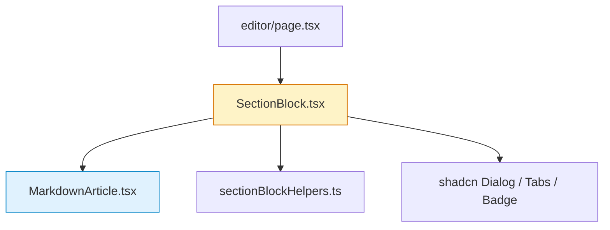

# Draft Page Refactor — Architecture

## 1. Architecture Overview

本次重构集中在前端表现层，不涉及后端 API 变更。核心修改分为两条线：

```
Line A — 排版增强        MarkdownArticle.tsx → 增强 prose 样式 + 标题层级
Line B — 面板重构        SectionBlock.tsx → 拆解右侧面板为紧凑列表 + 浮窗详情
```

### 影响范围



- 🟡 **SectionBlock.tsx** — 结构性修改（右侧面板交互重构）
- 🔵 **MarkdownArticle.tsx** — 样式增强（不改变接口）
- ⚪ **editor/page.tsx** — 无修改
- ⚪ **sectionBlockHelpers.ts** — 无修改

## 2. Line A — MarkdownArticle 排版增强

### 2.1 现状
```tsx
// 当前实现：仅 prose prose-slate + 少量 table 自定义样式
<div className={`prose prose-slate max-w-none ${compact ? 'prose-sm' : ''} ...`}>
  <Markdown remarkPlugins={[remarkGfm]} ...>{markdown}</Markdown>
</div>
```

### 2.2 方案

在 `MarkdownArticle` 组件中增强 Tailwind prose 类的自定义覆盖，专门针对标题层级、段落间距、列表样式进行强化。

#### 具体样式增强：

| 元素 | 当前 | 目标 |
|------|------|------|
| H1 | prose 默认 (~2em) | 1.875rem (30px), font-bold, 深色 slate-900, 上方 2.5em 间距, 下方 0.75em |
| H2 | prose 默认 (~1.5em) | 1.5rem (24px), font-semibold, slate-800, 左侧 3px 蓝色装饰线, 上方 2em |
| H3 | prose 默认 (~1.25em) | 1.25rem (20px), font-semibold, slate-700, 上方 1.5em |
| 段落 | leading-7 | leading-[1.85], text-slate-700, 段间 1.25em |
| 列表 | 默认 | 清晰缩进, list-disc/list-decimal 样式, 项间 0.5em |
| blockquote | 默认 | 左侧蓝色装饰线, 背景 slate-50, 圆角 |
| 表格 | 已有自定义 | 保持不变 |

#### 实现方式：
- 使用 Tailwind v4 的 `[&_h1]:...` 选择器覆盖 prose 默认值
- 不引入额外 CSS 文件
- `compact` 模式保持紧凑样式不受影响（用于侧边面板和弹窗内的 markdown 渲染）

## 3. Line B — 右侧面板重构

### 3.1 现状架构

```
CardContent (grid xl:grid-cols-[1fr_360px])
├── Left: Tabs (preview / guided / source)
└── Right: (360px, 全量堆叠)
    ├── Citations 区块（完整卡片列表）
    ├── Retrieval Trace 区块（完整展开）
    ├── Tables & Figures 区块（完整 AssetPreviewCard 列表）
    └── Assumptions 区块
```

### 3.2 目标架构

```
CardContent (grid xl:grid-cols-[1fr_380px])
+-- Left: Tabs (preview / guided / source) — 不变
+-- Right: (380px, 有限卡片面板)
    +-- Citations 区块
    |   +-- 最多展示 3 个卡片 — 点击某个卡片 -> MaterialDetailDialog
    |   +-- 超过 3 个时显示 "查看全部 N 个" 按钮 -> AllCandidatesDialog
    +-- Tables & Figures 区块
    |   +-- 最多展示 3 个卡片 — 点击某个卡片 -> MaterialDetailDialog
    |   +-- 超过 3 个时显示 "查看全部 N 个" 按钮 -> AllCandidatesDialog
    +-- Assumptions 折叠面板
    +-- [Retrieval Trace 默认隐藏，通过按钮展开]
```

**两种浮窗：**
1. **MaterialDetailDialog** — 点击单个卡片触发，展示该材料的完整详情
2. **AllCandidatesDialog** — 点击"查看全部"按钮触发，分类展示所有候选材料

### 3.3 候选材料详情浮窗 (MaterialDetailDialog)

```tsx
// 新增内部组件
function MaterialDetailDialog({
  open: boolean;
  onOpenChange: (open: boolean) => void;
  type: 'citation' | 'asset';
  citation?: Citation;
  asset?: RecommendedAsset;
  section: SectionDraft;
  evidenceMap: Record<string, EvidenceCard>;
  // ... action callbacks
})
```

#### 浮窗布局：

```
┌────────────────────────────────────────────────────┐
│  [×]   Citation/Asset Detail                        │
│  Description/Heading Path                           │
├────────────────────────────────────────────────────┤
│                                                     │
│  ┌─ 基本信息 ─────────────────────────────────┐    │
│  │ 来源文档：xxx.pdf                            │    │
│  │ 章节路径：总体方案 > 系统架构                  │    │
│  │ 类型：reuse_block    相关度：0.87             │    │
│  └─────────────────────────────────────────────┘    │
│                                                     │
│  ┌─ 内容预览 ─────────────────────────────────┐    │
│  │ （Markdown 渲染的原文内容）                    │    │
│  │  ...                                         │    │
│  └─────────────────────────────────────────────┘    │
│                                                     │
│  ┌─ 分数细节（可选）──────────────────────────┐    │
│  │ textual: 0.72  visual: 0.65  final: 0.87    │    │
│  └─────────────────────────────────────────────┘    │
│                                                     │
│  ┌─ 图片预览（仅视觉资产）────────────────────┐    │
│  │  [image]                                     │    │
│  └─────────────────────────────────────────────┘    │
│                                                     │
├────────────────────────────────────────────────────┤
│            [选中此依据]  [仅用此依据重写]  [插入正文]  │
└────────────────────────────────────────────────────┘
```

#### 尺寸适配策略：
- `max-w-5xl` (1024px) 或 `max-w-6xl` (1152px)
- `max-h-[85vh]` + 内部 overflow-y-auto
- 移动端自动全屏

### 3.4 全部候选材料浮窗 (AllCandidatesDialog)

```tsx
// 新增内部组件
function AllCandidatesDialog({
  open: boolean;
  onOpenChange: (open: boolean) => void;
  section: SectionDraft;
  evidenceMap: Record<string, EvidenceCard>;
  citations: Citation[];
  recommendedAssets: RecommendedAsset[];
  assetCandidates: RecommendedAsset[];
  // ... action callbacks
})
```

#### 浮窗布局：

```
+----------------------------------------------------+
|  [x]   全部候选材料 (N)                              |
+----------------------------------------------------+
|                                                     |
|  -- Citations (M) --------------------------------- |
|  | [card] [card] [card] [card] ...                 ||
|  | 每个卡片可点击展开详情                            ||
|  -------------------------------------------------- |
|                                                     |
|  -- Recommended Assets (K) ------------------------ |
|  | [card] [card] [card] ...                        ||
|  -------------------------------------------------- |
|                                                     |
|  -- More Candidates (J) --------------------------- |
|  | [card] [card] ...                               ||
|  -------------------------------------------------- |
|                                                     |
+----------------------------------------------------+
|                                        [关闭]       |
+----------------------------------------------------+
```

#### 尺寸适配策略：
- `max-w-6xl` (1152px)
- `max-h-[85vh]` + 内部 overflow-y-auto
- 每个分类区块使用区分的背景色和标题

### 3.5 Retrieval Trace 折叠处理

- 默认折叠，显示 "查看检索追踪" 按钮（使用 Lucide Search 图标）
- 点击后在面板内展开（不使用浮窗，因为这是调试信息，与候选材料不同）
- 展开后显示完整的 Query Intents / AI Wiki Priors / Decision / Token Budget / Section Candidates / Prompt Blocks

## 4. Component Extraction Plan

当前 `SectionBlock.tsx` 有 1599 行，为了可维护性，建议拆分：

```
components/editor/
+-- SectionBlock.tsx              # 主组件（瘦身后约 400 行）
+-- MarkdownArticle.tsx           # 排版增强（约 60 行）
+-- MaterialDetailDialog.tsx      # 单项候选材料详情浮窗（约 300 行）
+-- AllCandidatesDialog.tsx       # 全部候选材料分类浮窗（约 200 行）
+-- CompactCitationList.tsx       # 有限引用列表（最多3个 + 查看全部）（约 100 行）
+-- CompactAssetList.tsx          # 有限资产列表（最多3个 + 查看全部）（约 100 行）
+-- RetrievalTracePanel.tsx       # 可折叠的追踪面板（约 250 行）
+-- AssetPreviewCard.tsx          # 资产预览卡片（已有，提取出来）
+-- sectionBlockHelpers.ts        # 不变
+-- sectionBlockUtils.ts          # 从 SectionBlock 提取的工具函数
```

## 5. Migration Strategy

### Phase 1 — MarkdownArticle 排版增强
- 修改 `MarkdownArticle.tsx`，增加标题层级样式
- 零风险，纯样式变更
- 立即可验证

### Phase 2 — 组件提取
- 从 SectionBlock.tsx 提取 AssetPreviewCard、工具函数
- 功能不变，仅代码组织优化
- 可增量验证

### Phase 3 — 右侧面板重构
- 替换右侧面板为有限卡片列表（每类最多 3 个）
- 新增 MaterialDetailDialog（单项详情浮窗）
- 新增 AllCandidatesDialog（全部候选分类浮窗）
- 折叠 Retrieval Trace
- 保持所有操作按钮（选择、重生成、插入正文）功能

## 6. Technology Decisions

| 决策 | 选择 | 理由 |
|------|------|------|
| 浮窗组件 | shadcn Dialog | 已安装且与项目风格一致 |
| 图标库 | Lucide React | 已使用 |
| 排版方案 | Tailwind prose 覆盖 | 不引入新依赖 |
| 折叠组件 | 手动 state toggle | 不需要 Accordion 组件 |
| 分类展示 | 分区块 + 分隔线 | 浮窗内不需要 Tabs，线性布局更高效 |

