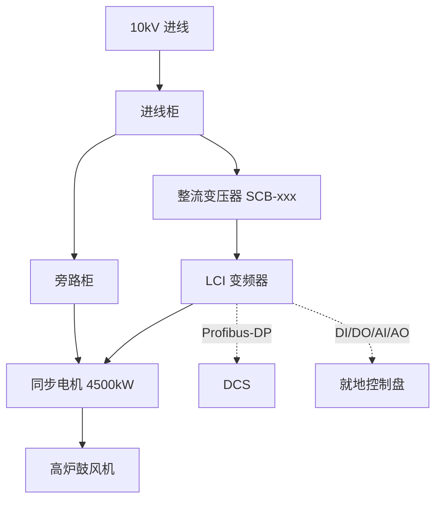

# 产品知识驱动的方案生成系统 — 迭代方案

> 更新日期：2026-04-19
> 定位：从"文档复用型 RAG"升级为"产品知识驱动的方案设计系统"
> 前置：`reuse-first-quality-next-plan.md`（MVP 已完成）
> 综合来源：独立代码分析 + ChatGPT Pro review

---

## 1. 核心判断

### 1.1 为什么要做这个方向

当前系统是**文档复用型 RAG**——从历史方案中找相似章节、组装、润色。它的天花板是：历史方案写过什么，它才能复用什么。

目标客户（电气行业公司）的实际工作模式是：

```
标准产品库 + 第三方产品 + 少量定制 → 选型配置 → 组合成方案 → 写成文档
```

这意味着**知识的源头不是"旧文档"，而是"产品目录"**。方案文档只是产品知识的一种输出形式。

### 1.2 升级后的系统定位

```
当前：  需求 → 检索旧文档 → 复用章节 → 输出
升级后：需求 → 产品选型 → 方案设计 → 检索+复用 → 输出
              ↑              ↑
         产品库（结构化）  LLM 工程知识
```

核心变化：在"检索旧文档"之前，先有一个**结构化的产品选型和方案设计环节**。这不替代现有链路，而是给现有链路提供更准确的输入。

### 1.3 与现有系统的关系

| 现有模块 | 保留/改动 | 说明 |
|---------|----------|------|
| `SectionDraftService` | 保留 | 仍然是章节生成主链路，但 prompt 会注入产品选型上下文 |
| `CaseLibraryService` | 保留 | 历史方案仍然是重要的文本参考来源 |
| `AssetRetrievalService` | 保留+增强 | 除了召回旧图，还可以从产品库生成新图 |
| `block_taxonomy` | 保留+扩充 | section_type/equipment_type 需要对齐产品目录 |
| `quality_gate` | 保留+增强 | 增加产品参数一致性检查 |
| `validation` | 保留 | VAL106 参数替换可对接产品库做精确校验 |
| **新增** | `ProductCatalogService` | 产品目录管理、选型推荐 |
| **新增** | `SolutionDesignAgent` | LLM 驱动的方案设计层 |
| **新增** | `DiagramGenerator` | 基于方案设计生成结构化图形 |

---

## 2. ChatGPT 方案的评估

> 以下是对 ChatGPT Pro 输出的技术方案的逐项评估。

### 采纳的建议

| ChatGPT 建议 | 采纳理由 |
|-------------|---------|
| 反馈闭环：工程师确认的方案反向写回知识库 | 正确。这就是 Layer 4（AI Wiki）的精简版 |
| 分阶段推进 | 正确。但它的时间线（1-2 个月建数据库）严重膨胀 |
| 数据更新机制 | 正确。产品库需要版本管理 |

### 修正或拒绝的建议

| ChatGPT 建议 | 问题 | 修正 |
|-------------|------|------|
| 推荐 KiCad | KiCad 是 PCB 设计工具，用于印刷电路板，不是电力系统方案图 | 用 Mermaid/D2 做系统框图，用 draw.io XML 做单线图 |
| LLM 微调 | 不必要且昂贵。当前 Claude/GPT-4 级别模型的电气知识已足够 | 用产品库作为结构化上下文注入 prompt，不微调 |
| "1-2 个月建数据库" | 已有 PostgreSQL + 完整后端基础设施 | 加 2-3 张表 + API 端点，1 周内可完成 schema |
| "MySQL 或 PostgreSQL" | 当前系统已用 PostgreSQL | 直接用现有 PostgreSQL |
| "设计数据库结构和模型" | 未给出任何具体 schema | 见下方 Section 3 的精确 schema 设计 |
| "确保图形符合行业标准" | 泛化的正确废话 | 先做系统框图/接口信号表（LLM 能力范围内），不做 CAD 级图纸 |

---

## 3. 产品目录 Schema 设计

### 3.1 数据模型

```sql
-- 产品族（如：变频器、软起动器、开关柜）
CREATE TABLE product_families (
    id UUID PRIMARY KEY DEFAULT gen_random_uuid(),
    name TEXT NOT NULL,                    -- "高压变频器"
    code TEXT NOT NULL UNIQUE,             -- "hv_vfd"
    category TEXT NOT NULL,                -- "power_conversion" / "protection" / "distribution"
    description TEXT,
    created_at TIMESTAMPTZ DEFAULT now(),
    updated_at TIMESTAMPTZ DEFAULT now()
);

-- 产品系列（如：HV-VFD-3300V 系列）
CREATE TABLE product_series (
    id UUID PRIMARY KEY DEFAULT gen_random_uuid(),
    family_id UUID REFERENCES product_families(id),
    name TEXT NOT NULL,                    -- "HV-VFD-3300V 系列"
    code TEXT NOT NULL UNIQUE,             -- "hv_vfd_3300v"
    voltage_levels TEXT[],                 -- {"3.3kV", "6kV", "10kV"}
    power_range_kw NUMRANGE,              -- [200, 8000]
    topology TEXT,                         -- "单元串联多电平"
    description TEXT,
    is_standard BOOLEAN DEFAULT true,      -- true=自有标准产品, false=第三方
    vendor TEXT,                           -- 第三方产品的供应商
    created_at TIMESTAMPTZ DEFAULT now(),
    updated_at TIMESTAMPTZ DEFAULT now()
);

-- 产品型号（具体规格）
CREATE TABLE product_models (
    id UUID PRIMARY KEY DEFAULT gen_random_uuid(),
    series_id UUID REFERENCES product_series(id),
    model_number TEXT NOT NULL,            -- "HV-VFD-3300V-2000"
    rated_power_kw NUMERIC,               -- 2000
    rated_voltage TEXT,                    -- "3.3kV"
    rated_current TEXT,                    -- "350A"
    specs JSONB DEFAULT '{}',             -- 其他技术参数（灵活扩展）
    created_at TIMESTAMPTZ DEFAULT now(),
    updated_at TIMESTAMPTZ DEFAULT now()
);

-- 产品接口定义
CREATE TABLE product_interfaces (
    id UUID PRIMARY KEY DEFAULT gen_random_uuid(),
    series_id UUID REFERENCES product_series(id),
    interface_type TEXT NOT NULL,          -- "communication" / "io_signal" / "power"
    protocol TEXT,                         -- "Modbus RTU" / "Profibus-DP" / "IEC 61850"
    signal_spec JSONB DEFAULT '{}',       -- {"DI": 16, "DO": 8, "AI": 4, "AO": 2}
    description TEXT,
    constraints TEXT[]                     -- {"需要外接RS485转换器", ...}
);

-- 产品兼容性关系
CREATE TABLE product_compatibility (
    id UUID PRIMARY KEY DEFAULT gen_random_uuid(),
    product_series_id UUID REFERENCES product_series(id),
    compatible_series_id UUID REFERENCES product_series(id),
    relationship TEXT NOT NULL,            -- "requires" / "recommends" / "replaces" / "conflicts"
    condition TEXT,                        -- "当电压等级 >= 6kV 时"
    notes TEXT
);

-- 标准配置模板
CREATE TABLE standard_configs (
    id UUID PRIMARY KEY DEFAULT gen_random_uuid(),
    series_id UUID REFERENCES product_series(id),
    config_name TEXT NOT NULL,             -- "标准配置" / "旁路配置" / "一拖二配置"
    components JSONB NOT NULL,            -- [{"role": "功率柜", "series_code": "..."}, ...]
    applicable_scenarios TEXT[],           -- {"风机", "泵", "压缩机"}
    constraints JSONB DEFAULT '[]',       -- [{"type": "altitude", "condition": ">1000m", "action": "降额"}]
    description TEXT
);

-- 产品使用约束
CREATE TABLE product_constraints (
    id UUID PRIMARY KEY DEFAULT gen_random_uuid(),
    series_id UUID REFERENCES product_series(id),
    constraint_type TEXT NOT NULL,         -- "environmental" / "electrical" / "mechanical"
    condition TEXT NOT NULL,               -- "海拔 > 1000m"
    action TEXT NOT NULL,                  -- "降额至额定功率的 90%"
    severity TEXT DEFAULT 'warning'        -- "warning" / "blocking"
);
```

### 3.2 产品卡示例数据

```json
{
  "family": "高压变频器",
  "series": "HV-VFD-3300V 系列",
  "code": "hv_vfd_3300v",
  "voltage_levels": ["3.3kV", "6kV", "10kV"],
  "power_range": "200kW ~ 8000kW",
  "topology": "单元串联多电平",
  "applicable_motors": ["异步电机", "同步电机"],
  "applicable_loads": ["风机", "泵", "压缩机", "输送机"],
  "standard_configs": [
    {
      "name": "标准配置",
      "components": ["功率柜×1", "控制柜×1", "进线柜×1"],
      "scenarios": ["一般节能调速"]
    },
    {
      "name": "旁路配置",
      "components": ["功率柜×1", "控制柜×1", "进线柜×1", "旁路柜×1"],
      "scenarios": ["要求工频旁路运行", "检修不停机"]
    }
  ],
  "interfaces": {
    "communication": ["Modbus RTU (RS485)", "Profibus-DP", "IEC 61850"],
    "io_signals": {"DI": 16, "DO": 8, "AI": 4, "AO": 2}
  },
  "protection": ["过流", "过压", "欠压", "接地故障", "过温", "功率单元故障"],
  "compatible_products": {
    "requires": ["整流变压器 SCB-xxx 系列"],
    "recommends": ["进线电抗器", "输出du/dt滤波器（电缆>100m时）"]
  },
  "constraints": [
    {"condition": "海拔 > 1000m", "action": "每升高 100m 降额 1%"},
    {"condition": "环温 > 40°C", "action": "需加装空调或降额"},
    {"condition": "同步电机", "action": "需配套励磁控制柜"}
  ]
}
```

---

## 4. 方案设计 Agent

### 4.1 定位

`SolutionDesignAgent` 是一个新的 LLM agent，职责是：

```
输入：客户需求（require_cards） + 产品目录
输出：推荐的产品选型和系统配置方案（solution_context）
```

它不替代 `SectionDraftService`，而是在大纲和章节生成之前运行，为后续步骤提供结构化的设计意图。

### 4.2 在现有流程中的位置

```
当前流程：
  create_project → retrieve_evidence → generate_outline → generate_sections → validate → export

升级后流程：
  create_project → retrieve_evidence → [design_solution] → generate_outline → generate_sections → validate → export
                                        ↑ 新增
```

### 4.3 输入输出 Schema

**输入（提供给 LLM）：**

```xml
<project_requirement>
  <project_name>某钢铁集团高炉鼓风机电机变频改造</project_name>
  <industry>钢铁</industry>
  <application>高炉鼓风机</application>
  <motor_spec>
    <type>同步电机</type>
    <voltage>10kV</voltage>
    <power>4500kW</power>
    <quantity>2</quantity>
  </motor_spec>
  <special_requirements>
    要求变频软起动，同步切换到工频运行
    DCS 通讯采用 Profibus-DP
    需要旁路切换功能
  </special_requirements>
</project_requirement>

<available_products>
  <!-- 从产品目录查询的候选产品列表 -->
  <product code="lci_series" name="LCI 变频软起动系统" ... />
  <product code="hv_vfd_10kv" name="10kV 高压变频器" ... />
  ...
</available_products>
```

**输出（结构化 JSON）：**

```json
{
  "solution_summary": "推荐采用 LCI 变频软起动方案，配套整流变压器和励磁控制柜",
  "selected_products": [
    {
      "role": "主驱动",
      "series_code": "lci_series",
      "config": "旁路配置",
      "quantity": 2,
      "rationale": "同步电机 + 大功率鼓风机场景，LCI 拓扑最匹配"
    },
    {
      "role": "整流变压器",
      "series_code": "scb_transformer",
      "quantity": 2,
      "rationale": "LCI 系统必须配套整流变压器"
    },
    {
      "role": "励磁控制柜",
      "series_code": "excitation_cabinet",
      "quantity": 2,
      "rationale": "同步电机需要独立励磁控制"
    }
  ],
  "interface_plan": {
    "dcs_protocol": "Profibus-DP",
    "io_allocation": {"DI": 32, "DO": 16, "AI": 8, "AO": 4},
    "notes": "每台 LCI 独立通讯节点"
  },
  "key_constraints": [
    "同步切换时序需要在控制策略章节详述",
    "旁路切换期间不得中断鼓风"
  ],
  "suggested_chapters": [
    "总体方案",
    "主回路方案",
    "启动与同步切换控制",
    "DCS 通讯接口方案",
    "保护联锁方案",
    "主要设备技术参数",
    "供货范围与配置清单",
    "调试与验收"
  ]
}
```

### 4.4 与章节生成的集成

`solution_context` 注入 `SectionDraftService` 的方式：

```python
# section_service.py 现有的 generate_section_content() 中
# 在 build_section_context() 时注入 solution_context

def build_section_context(
    section: dict,
    global_params: dict,
    solution_context: dict | None = None,  # ← 新增
    ...
):
    context_parts = []

    # 1. 产品选型上下文（新增）
    if solution_context:
        context_parts.append(format_solution_context(
            solution_context,
            target_section_type=section.get("section_type")
        ))

    # 2. 现有：历史方案复用块
    context_parts.append(format_reusable_blocks(...))

    # 3. 现有：推荐资产
    context_parts.append(format_recommended_assets(...))

    return "\n".join(context_parts)
```

对于每种章节类型，注入的产品信息不同：

| 章节类型 | 注入的产品信息 |
|---------|-------------|
| `overall_solution` | 完整的 solution_summary + 所有选型产品 |
| `main_circuit_scheme` | 主驱动产品的拓扑、接线方式、旁路配置 |
| `communication_interface` | interface_plan 的协议、信号分配 |
| `protection_interlock` | 所选产品的标准保护功能列表 |
| `bom_or_supply_list` | selected_products 的完整列表 + 数量 |
| `vfd_spec` / `motor_spec` | 对应产品的详细技术参数 |

---

## 5. 图形生成

### 5.1 分级可行性

| 图类型 | 生成方式 | 可行性 | 优先级 |
|--------|---------|--------|--------|
| 系统框图 | Mermaid flowchart | ⬆⬆ 高 | P0 |
| 接口信号表 | Markdown 表格 | ⬆⬆ 高 | P0 |
| 供货清单表 | Markdown/HTML 表格 | ⬆⬆ 高 | P0 |
| 系统单线图 | draw.io XML 或 SVG 模板 | ⬆ 中高 | P1 |
| 控制逻辑图 | Mermaid sequence diagram | ⬆ 中 | P1 |
| 柜体布局图 | SVG 模板 + 参数填充 | ⬇ 中低 | P2 |
| CAD 级施工图 | 不做 | ⬇⬇ | 不做 |

### 5.2 P0 图形：系统框图

LLM 基于 `solution_context` 生成 Mermaid 代码：

```python
# diagram_generator.py
class DiagramGenerator:
    async def generate_system_diagram(
        self,
        solution_context: dict,
    ) -> str:
        prompt = f"""
基于以下方案设计，生成系统框图的 Mermaid 代码。
要求：
1. 显示所有主要设备及其连接关系
2. 标注电压等级和功率
3. 标注通讯接口协议
4. 使用中文标注

<solution_context>
{json.dumps(solution_context, ensure_ascii=False, indent=2)}
</solution_context>

输出纯 Mermaid 代码，不要其他内容。
"""
        return await self.llm_client.generate(prompt, task="diagram")
```

生成的 Mermaid 示例：



### 5.3 不用 KiCad 的理由

> [!WARNING]
> ChatGPT 推荐了 KiCad，这是一个**严重的领域错误**。
>
> KiCad 是用于**印刷电路板 (PCB)** 设计的工具——设计芯片引脚、走线、焊盘。
> 你需要的是**电力系统方案图**——10kV 开关柜、变频器、变压器、电机的系统连接。
>
> 正确的工具选择：
> - **Mermaid / D2**：系统框图、流程图（LLM 可直接生成代码）
> - **draw.io XML**：单线图模板（结构化填充）
> - **SVG 模板引擎**：标准化图形模板 + 参数替换
> - **专业电力 CAD（如 EPLAN / E3）**：后期需要出正式图纸时（不在 MVP 范围）

---

## 6. 实施计划

### Phase 0：产品目录 Schema + 录入（1 周）

| 任务 | 文件 | 说明 |
|------|------|------|
| 新增产品目录表 | `backend/app/models/` 或数据库迁移 | 6 张表（见 Section 3） |
| 产品目录 CRUD API | `backend/app/api/products.py` | 标准 REST 端点 |
| 录入客户核心产品 | 数据脚本 | 20-30 个产品卡覆盖主营业务 |
| 产品兼容性定义 | 数据脚本 | 关键兼容/冲突关系 |

**验收**：
- 可通过 API 查询"给定 10kV 同步电机 4500kW 鼓风机，推荐什么产品"
- 返回结果包含主驱动 + 变压器 + 配套设备 + 约束条件

### Phase 1：SolutionDesignAgent（1-2 周）

| 任务 | 文件 | 说明 |
|------|------|------|
| 新增 SolutionDesignAgent | `backend/app/services/composition/solution_agent.py` | LLM 驱动的选型推理 |
| 产品检索服务 | `backend/app/services/retrieval/product_service.py` | 根据需求查询候选产品 |
| 集成到主流程 | `backend/app/api/composition.py` | 在 `generate_outline` 前调用 |
| solution_context 注入 | `section_service.py` | 章节 prompt 注入产品上下文 |

**验收**：
- 输入 LCI 鼓风机改造需求，Agent 输出正确的产品组合
- 生成的章节文本中引用的参数来自产品库（而非旧方案）
- 参数一致性：产品库中"额定功率 4500kW"出现在文档中不被篡改

### Phase 2：图形生成 POC（1 周）

| 任务 | 文件 | 说明 |
|------|------|------|
| 新增 DiagramGenerator | `backend/app/services/composition/diagram_generator.py` | Mermaid 代码生成 |
| 接口信号表生成 | 同上 | 从产品接口定义生成 Markdown 表格 |
| 供货清单表生成 | 同上 | 从 selected_products 生成清单 |
| 图形嵌入到章节 | `section_service.py` | 将 Mermaid 代码嵌入章节 markdown |

**验收**：
- 总体方案章节自动嵌入系统框图
- 接口章节自动嵌入信号分配表
- 供货范围章节自动嵌入设备清单表

### Phase 3：与现有链路融合 + 反馈闭环（1-2 周）

| 任务 | 文件 | 说明 |
|------|------|------|
| 大纲生成对接产品库 | outline 生成链路 | 章节建议来自 solution_context |
| validation 增加产品参数校验 | `validation/service.py` | VAL 新规则：检查参数与产品库一致 |
| block_taxonomy 对齐产品目录 | `block_taxonomy.py` | section_type/equipment_type 扩充 |
| 反馈写回 | 新增 API | 工程师确认的方案回写为"标准方案模板" |
| 同义词表从产品库自动提取 | `domain/synonyms.py` | 产品名/别名自动入同义词表 |

**验收**：
- 端到端：需求 → 选型 → 大纲 → 章节（含图表）→ 校验 → 导出
- 导出文档中的技术参数全部可追溯到产品库
- 工程师确认后的方案可作为下次类似需求的参考模板

---

## 7. 与前序优化方案的关系

| 前序方案中的 Layer | 当前计划状态 |
|-------------------|------------|
| **Layer 0：同义词扩展** | **仍然做，且升级**。同义词表可从产品库自动提取 |
| **Layer 1：章节真值层** | **仍然做**。产品库不替代文档解析，历史方案仍需准确 |
| **Layer 2：混合检索** | **仍然做**。case library 检索质量仍需提升 |
| **Layer 3：视觉检索** | **降低优先级**。如果图形可从产品数据生成，召回旧图的优先级降低 |
| **Layer 4：AI Wiki** | **被产品库方案吸收**。产品卡比通用 wiki 页面更结构化、更实用 |

---

## 8. 技术风险与缓解

| 风险 | 严重性 | 缓解措施 |
|------|--------|---------|
| 客户不愿意录入产品数据 | 高 | Phase 0 先由我们从产品手册中半自动提取，降低客户负担 |
| LLM 选型推理不准确 | 中 | Agent 只输出推荐+理由，最终由工程师确认。加 constraint 硬校验 |
| 产品组合复杂度爆炸 | 中 | 先只支持"单系统选型"（一台驱动+配套），不做多系统耦合 |
| Mermaid 图形不够专业 | 低 | Mermaid 用于方案文档级展示，正式施工图仍由 CAD 出 |
| 与现有 reuse-first 链路冲突 | 低 | 产品上下文是**增量注入**，不改变现有链路逻辑 |

---

## 9. 一句话总结

> **把客户的"产品目录"变成系统的"设计知识"，让 LLM 从"文档搬运工"变成"初级方案工程师"。** 先建产品库、再做选型 Agent、再加图形生成——每一步都沿着现有 `SectionDraftService` 的 seam 往里插，不做框架革命。
